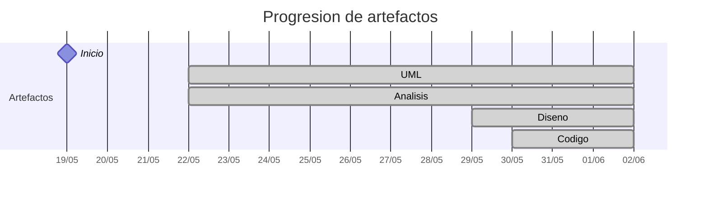

# Timeline - 31Diego

> Repo: [31Diego/25-26-idsw2-sdVC](https://github.com/31Diego/25-26-idsw2-sdVC)
> Commits: 14 | Días activos: 10 | Sesiones log: 0

## Patrón observado

| Métrica | Valor |
|---|---|
| Commits propios | 14 (8 feat / 4 fix / 2 other) |
| Ratio fix/feat | 0.50 |
| Días activos | 10 |
| Sesiones documentadas | 0 |

<!-- trazabilidad: manual -->
## Trazabilidad por caso de uso

> D7: "fix: split casos de uso con múltiples entradas por comportamiento" — creó 3 CUs nuevos por refinamiento

| Caso de uso | D4 | D5 | D7 | D11 | D12 | D14 |
|---|:---:|:---:|:---:|:---:|:---:|:---:|
| `abrirConvocatoria` | A |   |   | D | d |   |
| `abrirConvocatorias` | A |   |   | D | d |   |
| `abrirEntregable` |   | A |   |   |   |   |
| `abrirEntregables` |   | A |   |   |   |   |
| `abrirInvestigador` |   | A |   |   |   |   |
| `abrirInvestigadores` |   | A |   |   |   |   |
| `abrirMiPublicacion` |   | A |   |   |   |   |
| `abrirMisPublicaciones` |   | A |   |   |   |   |
| `abrirOpcionesCargaTrabajo` |   | A |   |   | d |   |
| `abrirOpcionesPerfil` |   | A |   |   | Dd |   |
| `abrirPanelPrincipal` |   | A |   |   | Dd |   |
| `abrirProyecto` |   | A |   |   |   | Dd |
| `abrirProyectos` |   | A |   |   |   | Dd |
| `abrirPublicacion` |   | A |   |   |   |   |
| `abrirPublicaciones` |   | A |   |   |   |   |
| `abrirRecompensa` |   | A |   |   |   |   |
| `abrirRecompensas` |   | A |   |   |   |   |
| `abrirSolicitudEliminacionPerfil` |   | A |   |   |   |   |
| `abrirSolicitudesEliminacionPerfil` |   | A |   |   |   |   |
| `agregarInvestigador` |   | A |   |   |   |   |
| `cerrarSesion` |   | A |   |   | Dd |   |
| `crearEntregable` |   | A |   |   |   |   |
| `crearInvestigador` |   | A |   |   |   |   |
| `crearProyecto` |   | A |   |   |   | Dd |
| `crearPublicacion` |   | A |   |   |   |   |
| `crearRecompensa` |   | A |   |   |   |   |
| `editarCargaTrabajo` |   | A |   |   | d |   |
| `editarEntregable` |   | A |   |   |   |   |
| `editarMiPublicacion` |   | A |   |   |   |   |
| `editarPerfil` |   | A |   |   | Dd |   |
| `editarProyecto` |   | A |   |   |   | Dd |
| `editarPublicacion` |   | A |   |   |   |   |
| `editarRecompensa` |   | A |   |   |   |   |
| `eliminarEntregable` |   | A |   |   |   |   |
| `eliminarInvestigador` |   | A |   |   |   |   |
| `eliminarMiPublicacion` |   | A |   |   |   |   |
| `eliminarProyecto` |   | A |   |   |   | Dd |
| `eliminarPublicacion` |   | A |   |   |   |   |
| `eliminarRecompensa` |   | A |   |   |   |   |
| `importarConvocatoria` |   | A |   |   |   |   |
| `iniciarSesion` |   | A |   |   | Dd |   |
| `responderPublicacion` |   | A |   |   |   |   |
| `solicitarEliminacionPerfil` |   | A |   |   |   |   |
| `abrirInvestigadoresDeProyecto` *(split D7)* |   |   | A |   |   |   |
| `abrirOpcionesPerfilInvestigador` *(split D7)* |   |   | A |   |   |   |
| `abrirProyectosDeInvestigador` *(split D7)* |   |   | A |   |   |   |

---

## Día 3 · 2026-05-21

### Commits (1: 1 feat / 0 fix)

| Hora | Mensaje |
|---|---|
| 16:50 | [feat: QUE_HACE.md](https://github.com/31Diego/25-26-idsw2-sdVC/commit/f034ff8f486f3bb665493c6e2d1e8b8ffc9bfa6c) |

> ⚠️ Commits sin entrada en log

---

## Día 4 · 2026-05-22

### Commits (2: 2 feat / 0 fix)

| Hora | Mensaje |
|---|---|
| 22:44 | [feat: análisis de abrirConvocatorias y corrección de estructura de carpetas](https://github.com/31Diego/25-26-idsw2-sdVC/commit/5dcc693f105aa41de1f884d7934c3780c7b38dfa) |
| 22:10 | [feat: CLAUDE.md, análisis abrirConvocatoria y registro de sesión](https://github.com/31Diego/25-26-idsw2-sdVC/commit/eeaebde9532bcc546ee2a47610e6559a2fcd0ee3) |

**Artefactos nuevos:** 📐 🔍 

> ⚠️ Commits sin entrada en log

---

## Día 5 · 2026-05-23

### Commits (1: 1 feat / 0 fix)

| Hora | Mensaje |
|---|---|
| 22:53 | [feat: análisis completo del coordinador — 43 casos de uso](https://github.com/31Diego/25-26-idsw2-sdVC/commit/4fee52742993c2e7c23ec774cc234803d1b3ebab) |

> ⚠️ Commits sin entrada en log

---

## Día 7 · 2026-05-25

### Commits (3: 1 feat / 2 fix)

| Hora | Mensaje |
|---|---|
| 21:49 | [fix: entradas secundarias faltantes en diagramas de coordinador](https://github.com/31Diego/25-26-idsw2-sdVC/commit/d80b4c93400859bf6ba37aa0f3f7d38c5f59ddbc) |
| 21:29 | [fix: split casos de uso con múltiples entradas por comportamiento](https://github.com/31Diego/25-26-idsw2-sdVC/commit/388167c7a3e6affad42cd5f3243ef5f91e66b9a0) |
| 20:22 | [feat: plantilla de navegación estados vs colaboraciones](https://github.com/31Diego/25-26-idsw2-sdVC/commit/033f41402ef0232dafa4226cc439e81b30e45b32) |

> ⚠️ Commits sin entrada en log

---

## Día 10 · 2026-05-28

### Commits (1: 0 feat / 0 fix)

| Hora | Mensaje |
|---|---|
| 22:26 | [docs: log de sesión — exploración de stack tecnológico](https://github.com/31Diego/25-26-idsw2-sdVC/commit/a968208408a156bc5bbe86fbf5f85f8c60c8bb68) |

> ⚠️ Commits sin entrada en log

---

## Día 11 · 2026-05-29

### Commits (1: 0 feat / 0 fix)

| Hora | Mensaje |
|---|---|
| 18:56 | [docs: log de sesión — decisiones de stack y diseño abrirConvocatoria/abrirConvocatorias](https://github.com/31Diego/25-26-idsw2-sdVC/commit/44fb88600a005923a0ebb4921e0f810a51b60c75) |

**Artefactos nuevos:** 🧩 

> ⚠️ Commits sin entrada en log

---

## Día 12 · 2026-05-30

### Commits (1: 1 feat / 0 fix)

| Hora | Mensaje |
|---|---|
| 19:43 | [feat: diseño y desarrollo P0 coordinador — iniciarSesion, cerrarSesion, panelPrincipal, perfil, cargaTrabajo](https://github.com/31Diego/25-26-idsw2-sdVC/commit/778956cf2b13d0546ecd118a68d0bcb5d75e60d7) |

**Artefactos nuevos:** 🔌 

> ⚠️ Commits sin entrada en log

---

## Día 13 · 2026-05-31

### Commits (1: 0 feat / 1 fix)

| Hora | Mensaje |
|---|---|
| 21:18 | [fix: corregir análisis iniciarSesion y cerrarSesion; borrar artefactos de diseño, desarrollo y código](https://github.com/31Diego/25-26-idsw2-sdVC/commit/2044578a515b7c5f27dac3f346fc86ac6265a7c0) |

> ⚠️ Commits sin entrada en log

---

## Día 14 · 2026-06-01

### Commits (1: 1 feat / 0 fix)

| Hora | Mensaje |
|---|---|
| 19:41 | [feat: corregir análisis coordinador y añadir diseño e implementación de proyectos](https://github.com/31Diego/25-26-idsw2-sdVC/commit/cf475b0efe5fc5b19c64bad88f30dab7b34ace92) |

> ⚠️ Commits sin entrada en log

---

## Día 15 · 2026-06-02

### Commits (2: 1 feat / 1 fix)

| Hora | Mensaje |
|---|---|
| 18:46 | [feat: archivo de revision de casos de analisis de ayer](https://github.com/31Diego/25-26-idsw2-sdVC/commit/1625a209848b0c99edd09aec0edbad2580ef481f) |
| 18:41 | [fix: corregir diagramas de secuencia de diseño — añadir navegador antes de la petición HTTP](https://github.com/31Diego/25-26-idsw2-sdVC/commit/8248ee788929582477e4ef09d939b4039b840d8e) |

> ⚠️ Commits sin entrada en log

---

