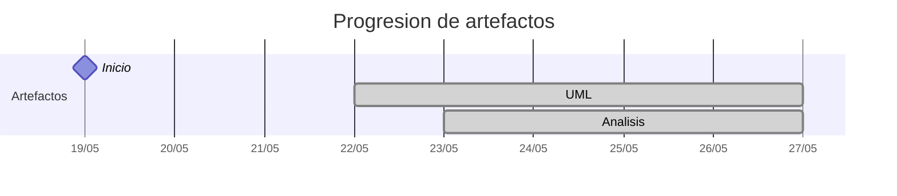

# Timeline - Alejandrojuarez0105

> Repo: [Alejandrojuarez0105/25-26-idsw2-sdVC](https://github.com/Alejandrojuarez0105/25-26-idsw2-sdVC)
> Commits: 24 | Días activos: 5 | Sesiones log: 18

## Patrón observado

| Métrica | Valor |
|---|---|
| Commits propios | 24 (15 feat / 1 fix / 8 other) |
| Ratio fix/feat | 0.06 |
| Días activos | 5 |
| Sesiones documentadas | 18 |
| Días log+commits | 5 |
| Días solo log | 0 |
| Días solo commits | 0 |

---

## Día 3 · 2026-05-21

### Commits (3: 0 feat / 0 fix)

| Hora | Mensaje |
|---|---|
| 23:23 | [refactor: corregir estructura de conversation-log.md sin modificar el contenido](https://github.com/Alejandrojuarez0105/25-26-idsw2-sdVC/commit/0a1b8f83b4e3b9a0c34818d5ee276aaf3167874b) |
| 23:09 | [chore: migración de la estructura RUP, corrección de rutas de imágenes y enlaces, README con enlace a Davidario](https://github.com/Alejandrojuarez0105/25-26-idsw2-sdVC/commit/925a477f3f436320a68a376aac42651f97db99c0) |
| 11:41 | [docs: primer commit, QUE_HACE.md](https://github.com/Alejandrojuarez0105/25-26-idsw2-sdVC/commit/7dc2e48dada807135c363a4c185de5b2d12ff50e) |

### 💬 Conversation-log (2 sesiónes)

- Sesión 1: Migración inicial de artefactos RUP
- Sesión 1: Corrección de migración y refactorización de enlaces

> 💬 + commits = proceso documentado

---

## Día 4 · 2026-05-22

### Commits (1: 0 feat / 0 fix)

| Hora | Mensaje |
|---|---|
| 18:25 | [refactor: centralizar imágenes y modelos UML para una estructura global organizada](https://github.com/Alejandrojuarez0105/25-26-idsw2-sdVC/commit/b10f76784adf63ee46501898f03c93dd2e6d7087) |

### 💬 Conversation-log (1 sesión)

- Sesión 2: Centralización de recursos y reorganización estructural

**Artefactos nuevos:** 📐 

> 💬 + commits = proceso documentado

---

## Día 5 · 2026-05-23

### Commits (4: 2 feat / 0 fix)

| Hora | Mensaje |
|---|---|
| 01:44 | [feat: análisis del caso de uso cerrarSesion y registrar cierre de sesión 4](https://github.com/Alejandrojuarez0105/25-26-idsw2-sdVC/commit/b8f159081c0ba3d3b6b44ca8e42f23ddf5a343e2) |
| 15:37 | [docs: cierre de sesión 3 con actualización de conversation-log.md](https://github.com/Alejandrojuarez0105/25-26-idsw2-sdVC/commit/57a8555189f3a740f802c18f26a19e6a0c9083ee) |
| 15:34 | [feat: crear estructura de la disciplina de análisis de requisitos y primer caso de uso iniciarSesion](https://github.com/Alejandrojuarez0105/25-26-idsw2-sdVC/commit/6a78461489578c4a183be59925828d578e5afdee) |
| 12:59 | [docs: añadir AGENTES.md y actualizar conservation-log.md con nueva estructura de sesiones](https://github.com/Alejandrojuarez0105/25-26-idsw2-sdVC/commit/f0166f7851878e684b5ff7825ae440a57b9c79df) |

### 💬 Conversation-log (2 sesiónes)

- Sesión 3: Fase de Análisis e iniciarSesion()
- Sesión 4: Análisis de cerrarSesion()

**Artefactos nuevos:** 🔍 

> 💬 + commits = proceso documentado

---

## Día 6 · 2026-05-24

### Commits (8: 5 feat / 1 fix)

| Hora | Mensaje |
|---|---|
| 01:54 | [feat: desarrollar el análisis del caso de uso editarGrado y cierre de sesión 9](https://github.com/Alejandrojuarez0105/25-26-idsw2-sdVC/commit/dcd8b61a2422e04c7ef50a812f07ff7299f1b749) |
| 18:25 | [feat: desarrollar el análisis del caso de uso crearGrado y cierre de sesión 8](https://github.com/Alejandrojuarez0105/25-26-idsw2-sdVC/commit/16217bdeef18f608d8ec0a5191b77e878bfdb45c) |
| 16:43 | [fix: agregar importarGrados a los README de RUP/01-analisis y RUP/01-analisis/caso-uso](https://github.com/Alejandrojuarez0105/25-26-idsw2-sdVC/commit/c92ae4c52f749bb27dbf29917bea31487aedafac) |
| 16:36 | [feat: desarrollar el análisis del caso de uso eliminarGrado y cierre de sesión 7](https://github.com/Alejandrojuarez0105/25-26-idsw2-sdVC/commit/98fc54daa3ac8fd942a35e1131383035eea78b8e) |
| 14:56 | [docs: cierre de sesión 6 y actualización de conversation-log.md](https://github.com/Alejandrojuarez0105/25-26-idsw2-sdVC/commit/d5fedf58f1a767492548f8e8fbdcc34ee532bce2) |
| 14:36 | [feat: desarrollar caso de uso importarGrados](https://github.com/Alejandrojuarez0105/25-26-idsw2-sdVC/commit/2ff4a42a5ca9a72b91550dde87da4a9ad6de345e) |
| 12:38 | [docs: registrar cierre de sesión 5](https://github.com/Alejandrojuarez0105/25-26-idsw2-sdVC/commit/b6d8e4a69a25f02af543cab4c0db14a1f62f936c) |
| 12:05 | [feat: desarrollar caso de uso abrirGrados y estandarizar estructura de casos de uso](https://github.com/Alejandrojuarez0105/25-26-idsw2-sdVC/commit/088c23044edfac42c844e365fa5a8502ffb2298e) |

### 💬 Conversation-log (4 sesiónes)

- Sesión 5: Análisis RUP - abrirGrados()
- Sesión 6: Análisis RUP - importarGrados()
- Sesión 7: Análisis RUP - eliminarGrado()
- Sesión 8: Análisis RUP - crearGrado()

> 💬 + commits = proceso documentado

---

## Día 7 · 2026-05-25

### Commits (8: 8 feat / 0 fix)

| Hora | Mensaje |
|---|---|
| 22:13 | [feat: desarrollar el análisis del caso de uso crearExamen y cierre de sesión 17](https://github.com/Alejandrojuarez0105/25-26-idsw2-sdVC/commit/1521f3b2f90e93ce16de887162438c5b6ceec817) |
| 16:44 | [feat: desarrollar el análisis del caso de uso eliminarExamen y cierre de sesión 16](https://github.com/Alejandrojuarez0105/25-26-idsw2-sdVC/commit/f3c5a6fe42e020642cc5ce902a840b08b7c2cf8a) |
| 15:34 | [feat: desarrollar el análisis del caso de uso abrirExamenes y cierre de sesión 15](https://github.com/Alejandrojuarez0105/25-26-idsw2-sdVC/commit/ad96aff5c9c93b7b710cce932a18bca9f1f6b6e2) |
| 13:58 | [feat: desarrollar el análisis del caso de uso editarAsignatura y cierre de sesión 14](https://github.com/Alejandrojuarez0105/25-26-idsw2-sdVC/commit/a2136121123ec6f8d838eb13ec5b88a3478a503d) |
| 13:38 | [feat: desarrollar el análisis del caso de uso crearAsignatura y cierre de sesión 13](https://github.com/Alejandrojuarez0105/25-26-idsw2-sdVC/commit/3b73bcf4f825e7e466d2550fc47d167a9d07d700) |
| 12:43 | [feat: desarrollar el análisis del caso de uso eliminarAsignatura y cierre de sesión 12](https://github.com/Alejandrojuarez0105/25-26-idsw2-sdVC/commit/587cf475acd867627ef471f76246136805903d03) |
| 11:36 | [feat: desarrollar el análisis del caso de uso importarAsignaturas y cierre de sesión 11](https://github.com/Alejandrojuarez0105/25-26-idsw2-sdVC/commit/eab8390704ae4c57c72e046ff09b139ada9a625c) |
| 10:51 | [feat: desarrollar el análisis del caso de uso abrirAsignaturas y cierre de sesión 10](https://github.com/Alejandrojuarez0105/25-26-idsw2-sdVC/commit/a9ae9246e530ffc562947c47cfe431b2b991e8a3) |

### 💬 Conversation-log (9 sesiónes)

- Sesión 9: Análisis RUP - editarGrado()
- Sesión 10: Análisis RUP - abrirAsignaturas()
- Sesión 11: Análisis RUP - importarAsignaturas()
- Sesión 12: Análisis RUP - eliminarAsignatura()
- Sesión 13: Análisis RUP - crearAsignatura()
- Sesión 14: Análisis RUP - editarAsignatura()
- Sesión 15: Análisis RUP - abrirExamenes()
- Sesión 16: Análisis RUP - eliminarExamen()
- Sesión 17: Análisis RUP - crearExamen() y expansión no solicitada de casos de uso

> 💬 + commits = proceso documentado

---

