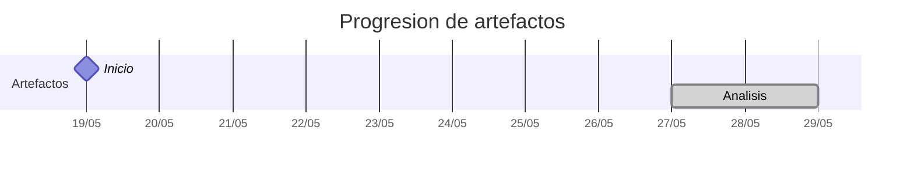

# Timeline - Andecochea

> Repo: [Andecochea/25-26-idsw2-sdVC](https://github.com/Andecochea/25-26-idsw2-sdVC)
> Commits: 2 | Días activos: 2 | Sesiones log: 2

## Patrón observado

| Métrica | Valor |
|---|---|
| Commits propios | 2 (1 feat / 0 fix / 1 other) |
| Días activos | 2 |
| Sesiones documentadas | 2 |
| Días log+commits | 1 |
| Días solo log | 0 |
| Días solo commits | 1 |

## Trazabilidad por caso de uso

| Caso de uso | D9 |
|---|:---:|
| `casos-uso` | A |

---

## Día 5 · 2026-05-23

### Commits (1: 1 feat / 0 fix)

| Hora | Mensaje |
|---|---|
| 19:19 | [feat: primer commit, QUE_HACE](https://github.com/Andecochea/25-26-idsw2-sdVC/commit/2fe6ee96156f167dc74d89703b9fadac26b1af46) |

> ⚠️ Commits sin entrada en log

---

## Día 9 · 2026-05-27

### Commits (1: 0 feat / 0 fix)

| Hora | Mensaje |
|---|---|
| 17:17 | [docs: inicializar configuración del asistente y protocolo de entrega en conversation-log.md](https://github.com/Andecochea/25-26-idsw2-sdVC/commit/d739fb51b6c530298626f0b056c6095f10671e0a) |

### 💬 Conversation-log (2 sesiónes)

- Configuración Inicial del Asistente
- Definición del Protocolo de Entrega 'enviar trabajo'

**Artefactos nuevos:** 🔍 

> 💬 + commits = proceso documentado

---

