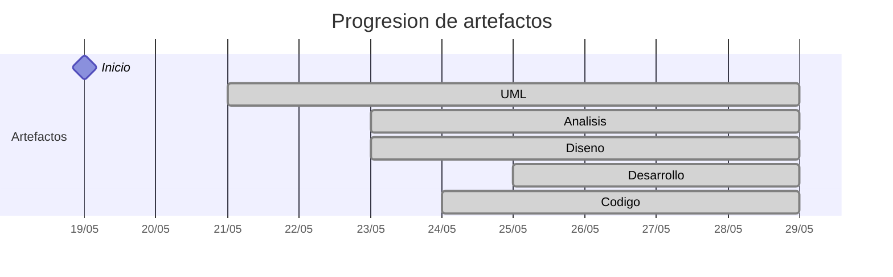

# Timeline - Camila-Lesly

> Repo: [Camila-Lesly/25-26-idsw2-sdVC](https://github.com/Camila-Lesly/25-26-idsw2-sdVC)
> Commits: 54 | Días activos: 7 | Sesiones log: 18

## Patrón observado

| Métrica | Valor |
|---|---|
| Commits propios | 54 (31 feat / 8 fix / 15 other) |
| Ratio fix/feat | 0.25 |
| Días activos | 7 |
| Sesiones documentadas | 18 |
| Sesiones sin fecha en log | 18 |

## Trazabilidad por caso de uso

| Caso de uso | D3 | D5 | D7 |
|---|:---:|:---:|:---:|
| `login` | A | D | d |
| `abrirEspacios` | A | D | d |
| `crearEspacio` | A | D | d |
| `editarEspacio` | A | D | d |
| `eliminarEspacio` | A | D | d |
| `buscarEspacio` | A | D | d |
| `verEspacio` | A | D | d |
| `cambiarEspacio` | A | D | d |
| `listarRutas` | A | D | d |
| `seleccionarRuta` | A | D | d |
| `abrirRuta` | A | D | d |
| `verDetalles` | A | D | d |
| `verEspaciosCercanos` | A | D | d |
| `iniciarVisita` | A | D |   |

---

## Día 3 · 2026-05-21

### Commits (21: 19 feat / 2 fix)

| Hora | Mensaje |
|---|---|
| 15:04 | [feat(docs):update conversation-log](https://github.com/Camila-Lesly/25-26-idsw2-sdVC/commit/ab50d810f621af4a2277fa4acbdb9a04dc21bc8e) |
| 14:45 | [fix(docs):delete comment](https://github.com/Camila-Lesly/25-26-idsw2-sdVC/commit/fa46abe18f2b639982e7ecd1d8a816877952486d) |
| 14:44 | [feat(docs):add new use case of see nearby spaces for visitor](https://github.com/Camila-Lesly/25-26-idsw2-sdVC/commit/d824c57b7e96cd11d84223e39a837b6876694048) |
| 14:44 | [feat(docs):add new use case of see details for visitor](https://github.com/Camila-Lesly/25-26-idsw2-sdVC/commit/ff8a7ed5e36d83dd3e8b86313e01ba91e763f0bf) |
| 14:43 | [feat(docs):add new use case of open route for visitor](https://github.com/Camila-Lesly/25-26-idsw2-sdVC/commit/828afcd93ccc2d4681e8564802169ef548fd6611) |
| 14:43 | [feat(docs):add new use case of select  route for visitor](https://github.com/Camila-Lesly/25-26-idsw2-sdVC/commit/66ce2f76c8adc508bd41cb1301debbc7809cf2b8) |
| 14:42 | [feat(docs):add new use case of list route for visitor](https://github.com/Camila-Lesly/25-26-idsw2-sdVC/commit/41dfdf26d8e3052b5629f7c6bb96aa5da545292e) |
| 14:42 | [feat(docs):add new use case of change space for visitor](https://github.com/Camila-Lesly/25-26-idsw2-sdVC/commit/f0caa602589d3836545c69f92331a62fc38de74b) |
| 14:41 | [feat(docs):add new use case of view for visitor](https://github.com/Camila-Lesly/25-26-idsw2-sdVC/commit/b52844a908562fc28fa6679409d4bc16e2f242b9) |
| 14:39 | [feat(docs):add new use case of search space for visitor](https://github.com/Camila-Lesly/25-26-idsw2-sdVC/commit/9b8764cbb26b108fa0810f1d974190cfb31a59db) |
| 14:38 | [feat(docs):add new use case of start visit for visitor](https://github.com/Camila-Lesly/25-26-idsw2-sdVC/commit/b4a9161b18eb108bf7d2724058046463fa154af9) |
| 13:44 | [feat(docs):update README.md](https://github.com/Camila-Lesly/25-26-idsw2-sdVC/commit/748a0a3e5301c6d2ccfed6aef8f87bd05ebb4393) |
| 13:36 | [fix(docs):correct spelling in markdown documentation](https://github.com/Camila-Lesly/25-26-idsw2-sdVC/commit/3bb9615c23f30ad3057bf5d0f98ecde33b2b4a83) |
| 13:04 | [feat(docs):update conversation-log](https://github.com/Camila-Lesly/25-26-idsw2-sdVC/commit/182ea228a6b5e6825de7b036c806cdd1c34ceb8b) |
| 12:22 | [feat(docs):update  uses cases of delete  for admin](https://github.com/Camila-Lesly/25-26-idsw2-sdVC/commit/541188e7028b340c9b8944fb4716014361ef0168) |
| 12:22 | [feat(docs):update  uses cases of edit for admin](https://github.com/Camila-Lesly/25-26-idsw2-sdVC/commit/08304e18b8524800f82f86d785ccd587d61222dc) |
| 12:21 | [feat(docs):update  uses cases of create for admin](https://github.com/Camila-Lesly/25-26-idsw2-sdVC/commit/eb2a51096ac11b03b3ed0d8a7cc8fcfc89365269) |
| 12:20 | [feat(docs):update  uses cases of  open for admin](https://github.com/Camila-Lesly/25-26-idsw2-sdVC/commit/211c05995a5e9cd3e165c8dcea7a3a829c2f53b6) |
| 12:19 | [feat(docs):add new use case login](https://github.com/Camila-Lesly/25-26-idsw2-sdVC/commit/87fafc926054e9497c6ab0a8b5d4764f6f2f56bc) |
| 12:17 | [feat(docs):add new collaboration teplates](https://github.com/Camila-Lesly/25-26-idsw2-sdVC/commit/1ad4f45a9db156bb89e6e83775e92117e6805b33) |
| 12:14 | [feat(docs):update QUE_HACE.md](https://github.com/Camila-Lesly/25-26-idsw2-sdVC/commit/6658497ec729b56f843315f002f38d8369d6b98c) |

**Artefactos nuevos:** 📐 

> ⚠️ Commits sin entrada en log

---

## Día 4 · 2026-05-22

### Commits (7: 3 feat / 0 fix)

| Hora | Mensaje |
|---|---|
| 09:25 | [feat(docs):update conversation-log](https://github.com/Camila-Lesly/25-26-idsw2-sdVC/commit/f7aeb36966cb1f9a0cbaac86efa08d0b586b3bb3) |
| 09:25 | [feat(docs):update new documentation](https://github.com/Camila-Lesly/25-26-idsw2-sdVC/commit/20872e23c8419e3bd1ab127b0fa90205ca628e95) |
| 09:24 | [docs: add the final views diagram](https://github.com/Camila-Lesly/25-26-idsw2-sdVC/commit/99779087d6af03f8492412d1b8018eed439a3cec) |
| 09:24 | [docs: add the final controllers diagram](https://github.com/Camila-Lesly/25-26-idsw2-sdVC/commit/18ac68e069cd2f10f6198bff31619e0dd4bc5613) |
| 09:23 | [docs: add the final model diagram](https://github.com/Camila-Lesly/25-26-idsw2-sdVC/commit/d5144ee4f8b77c75d8a916b1205196bc9e03d674) |
| 09:22 | [feat(docs): update SVG for each use case diagram](https://github.com/Camila-Lesly/25-26-idsw2-sdVC/commit/5bff3f2b1cf1f48d398c0d02edf9d435790112d2) |
| 09:19 | [refactor(docs): reorganize project files](https://github.com/Camila-Lesly/25-26-idsw2-sdVC/commit/5a8f0bf8450f07dc0104fdb970b59915a1a066ac) |

> ⚠️ Commits sin entrada en log

---

## Día 5 · 2026-05-23

### Commits (3: 1 feat / 0 fix)

| Hora | Mensaje |
|---|---|
| 23:02 | [feat(docs): update conversation-log](https://github.com/Camila-Lesly/25-26-idsw2-sdVC/commit/a9351b0d5afcf6582d438fb1b43273f8c7164c7a) |
| 22:14 | [refactor(docs): update MVC diagrams](https://github.com/Camila-Lesly/25-26-idsw2-sdVC/commit/99392eecfad0cfc062e5a0feb715c464856728e1) |
| 21:10 | [docs(arch):add spec.md for architecture planning](https://github.com/Camila-Lesly/25-26-idsw2-sdVC/commit/3fe25dbb2875f451de4d9c719b8f53b3587ea196) |

**Artefactos nuevos:** 🔍 🧩 

> ⚠️ Commits sin entrada en log

---

## Día 6 · 2026-05-24

### Commits (4: 3 feat / 0 fix)

| Hora | Mensaje |
|---|---|
| 00:43 | [feat:initial design and implementation iteration for the MyUniverse project](https://github.com/Camila-Lesly/25-26-idsw2-sdVC/commit/054d9d391b59508f6646d1102b889e176ecc0e64) |
| 00:27 | [feat(docs):update conversation-log](https://github.com/Camila-Lesly/25-26-idsw2-sdVC/commit/c2ecc4886cd94a5f6b022df27e0db0897142ff13) |
| 00:17 | [refactor(docs):update diagrams and spec.md](https://github.com/Camila-Lesly/25-26-idsw2-sdVC/commit/6dd58893e1fcb71c7b21de0faf9f5f60c55769ce) |
| 13:11 | [feat(desing): update desing diagrams and readme](https://github.com/Camila-Lesly/25-26-idsw2-sdVC/commit/6f05a517d22a900f0604bf827d15bd407276acbc) |

**Artefactos nuevos:** 🔌 

> ⚠️ Commits sin entrada en log

---

## Día 7 · 2026-05-25

### Commits (2: 1 feat / 0 fix)

| Hora | Mensaje |
|---|---|
| 23:49 | [refactor(uml):update design diagrams and specs with new functions](https://github.com/Camila-Lesly/25-26-idsw2-sdVC/commit/60c07a7de80661e28dbfd6daf32557ffcdb8b3cb) |
| 15:40 | [feat(docs):add new documentation](https://github.com/Camila-Lesly/25-26-idsw2-sdVC/commit/d3786f49ed7fb2cbc0dd8a7461d47d0e14bf1f45) |

**Artefactos nuevos:** ⚙️ 

> ⚠️ Commits sin entrada en log

---

## Día 8 · 2026-05-26

### Commits (12: 3 feat / 3 fix)

| Hora | Mensaje |
|---|---|
| 00:19 | [fix(docs): update documentation](https://github.com/Camila-Lesly/25-26-idsw2-sdVC/commit/68f31fd6f1235c66eb5adc4015fa16accf3cd28f) |
| 00:17 | [fix: add menu](https://github.com/Camila-Lesly/25-26-idsw2-sdVC/commit/58a249e7af4ddcb44e88fe3b2eda01962fa89b76) |
| 00:16 | [fix: update conversation-log](https://github.com/Camila-Lesly/25-26-idsw2-sdVC/commit/0e17f9172c6c3859865f7f33c3e03447d9a33ba3) |
| 00:14 | [feat(docs): update documentation](https://github.com/Camila-Lesly/25-26-idsw2-sdVC/commit/d02bd68fbf3cdbf78902189709d6b2b42f59c713) |
| 23:40 | [feat: update json file](https://github.com/Camila-Lesly/25-26-idsw2-sdVC/commit/f0af5f7aa2796c1600596b0d02ef8bc3ab86bd3d) |
| 22:46 | [refactor: restructure codebase and enhance core logic](https://github.com/Camila-Lesly/25-26-idsw2-sdVC/commit/b10a831834aad397c5823b57bf9adc3458575480) |
| 22:35 | [feat: update new links of desing diagram](https://github.com/Camila-Lesly/25-26-idsw2-sdVC/commit/acc6e58dfa4569affef01210e494cc2365c0e254) |
| 22:34 | [refactor(docs): update new diagram desing](https://github.com/Camila-Lesly/25-26-idsw2-sdVC/commit/4ccdb61ff6008222da3c9f4ec659cf69ada38992) |
| 20:29 | [refactor: update context diagram of visit](https://github.com/Camila-Lesly/25-26-idsw2-sdVC/commit/bdbb7c7290b1a1e721b0dc2532c89ed7add5f5f8) |
| 19:58 | [refactor(desing): update view nearby spaces](https://github.com/Camila-Lesly/25-26-idsw2-sdVC/commit/d42f1353248070c6646322a9a1def0f292c873df) |
| 19:29 | [refactor(desing): remove start visit and refactor uses cases](https://github.com/Camila-Lesly/25-26-idsw2-sdVC/commit/e2dd0fa464e6719cecb0454b9d8c47cec33b5afe) |
| 18:46 | [refactor(diagrams):delete use case start visit](https://github.com/Camila-Lesly/25-26-idsw2-sdVC/commit/1f8dc138ad8c565b48b9a04cd9063914603450af) |

> ⚠️ Commits sin entrada en log

---

## Día 9 · 2026-05-27

### Commits (5: 1 feat / 3 fix)

| Hora | Mensaje |
|---|---|
| 12:40 | [fix(docs): fix alignment issue in README.md](https://github.com/Camila-Lesly/25-26-idsw2-sdVC/commit/cbd2ffd9a7ddf6c30aa90a0764bba6c620a227d5) |
| 12:39 | [fix(docs): update missing div](https://github.com/Camila-Lesly/25-26-idsw2-sdVC/commit/df043ba92b1aad7a8867ee9b84410d7033e49aa9) |
| 12:38 | [Refactor README to remove duplicate image and clean up](https://github.com/Camila-Lesly/25-26-idsw2-sdVC/commit/96d2c337b6e85c0c48235790d0927319d73ee0c4) |
| 12:36 | [fix(docs):fixing broken links and update documentation](https://github.com/Camila-Lesly/25-26-idsw2-sdVC/commit/b444cf348a9037c151253b83c81eb355cf250096) |
| 08:04 | [feat: update new botom](https://github.com/Camila-Lesly/25-26-idsw2-sdVC/commit/ce8c0a0dba8c0cb5d21b8843afa716ec38033515) |

> ⚠️ Commits sin entrada en log

---

