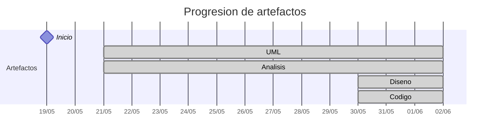

# Timeline - Pareyor

> Repo: [Pareyor/25-26-idsw2-sdVC](https://github.com/Pareyor/25-26-idsw2-sdVC)
> Commits: 78 | Días activos: 12 | Sesiones log: 13

## Patrón observado

| Métrica | Valor |
|---|---|
| Commits propios | 78 (57 feat / 20 fix / 1 other) |
| Ratio fix/feat | 0.35 |
| Días activos | 12 |
| Sesiones documentadas | 13 |
| Días log+commits | 12 |
| Días solo log | 0 |
| Días solo commits | 0 |

## Trazabilidad por caso de uso

| Caso de uso | D3 | D4 | D5 | D6 | D7 | D8 | D9 | D10 | D12 | D13 |
|---|:---:|:---:|:---:|:---:|:---:|:---:|:---:|:---:|:---:|:---:|
| `corregirExamenes` | A |   |   |   |   |   |   |   |   |   |
| `exportarConfiguracionGlobal` | A |   |   |   |   |   |   |   |   |   |
| `generarExamenes` | A |   |   |   |   |   |   |   |   |   |
| `importarAlumnos` | A |   |   |   |   |   |   |   |   |   |
| `importarConfiguracionGlobal` | A |   |   |   |   |   |   |   |   |   |
| `asignarExamenes` |   | A |   |   |   |   |   |   |   |   |
| `crearPregunta` |   | A |   |   |   |   |   |   |   |   |
| `exportarAlumnos` |   | A |   |   |   |   |   |   |   |   |
| `exportarPreguntas` |   | A |   |   |   |   |   |   |   |   |
| `importarPreguntas` |   | A |   |   |   |   |   |   |   |   |
| `crearAlumno` |   |   | A |   |   |   |   |   |   |   |
| `crearDocente` |   |   | A |   |   |   |   |   |   |   |
| `editarAsignatura` |   |   | A |   |   |   |   |   |   |   |
| `editarDocente` |   |   | A |   |   |   |   |   |   |   |
| `editarPregunta` |   |   | A |   |   |   |   |   |   |   |
| `crearAsignatura` |   |   |   | A |   |   |   |   |   |   |
| `crearGrado` |   |   |   | A |   |   |   |   |   |   |
| `editarAlumno` |   |   |   | A |   |   |   |   |   |   |
| `editarGrado` |   |   |   | A |   |   |   |   |   |   |
| `verPreguntas` |   |   |   | A |   |   |   |   |   | D |
| `eliminarPregunta` |   |   |   |   | A |   |   |   |   |   |
| `verAlumnos` |   |   |   |   | A |   |   |   |   | D |
| `verAsignaturas` |   |   |   |   | A |   |   |   |   | D |
| `verDocentes` |   |   |   |   | A |   |   |   |   | D |
| `verGrados` |   |   |   |   | A |   |   |   |   | D |
| `eliminarAlumno` |   |   |   |   |   | A |   |   |   |   |
| `eliminarAsignatura` |   |   |   |   |   | A |   |   |   |   |
| `eliminarDocente` |   |   |   |   |   | A |   |   |   |   |
| `eliminarGrado` |   |   |   |   |   | A |   |   |   |   |
| `iniciarSesion` |   |   |   |   |   | A |   |   | D |   |
| `cerrarSesion` |   |   |   |   |   |   | A |   | D |   |
| `completarGestion` |   |   |   |   |   |   | A |   | D |   |
| `crearRespuesta` |   |   |   |   |   |   | A |   |   |   |
| `verRespuestas` |   |   |   |   |   |   | A |   |   |   |
| `cancelarGeneracion` |   |   |   |   |   |   |   | A |   |   |
| `editarRespuesta` |   |   |   |   |   |   |   | A |   |   |
| `eliminarRespuesta` |   |   |   |   |   |   |   | A |   |   |
| `exportarAsignaturas` |   |   |   |   |   |   |   | A |   |   |
| `exportarGrados` |   |   |   |   |   |   |   | A |   |   |
| `importarAsignaturas` |   |   |   |   |   |   |   | A |   |   |
| `importarGrados` |   |   |   |   |   |   |   | A |   |   |

---

## Día 2 · 2026-05-20

### Commits (2: 2 feat / 0 fix)

| Hora | Mensaje |
|---|---|
| 17:40 | [feat: Reescribe README.md provisionalmente y actualiza conversation-log.md del dia](https://github.com/Pareyor/25-26-idsw2-sdVC/commit/306e151a13074bd34790d343d12649e16a9675f5) |
| 17:08 | [feat: QUE_HACE.md](https://github.com/Pareyor/25-26-idsw2-sdVC/commit/b4b488d29498c15ea8a4d9ebafe1806597a103c1) |

### 💬 Conversation-log (1 sesión)

- Sesión 1: [17:38]

> 💬 + commits = proceso documentado

---

## Día 3 · 2026-05-21

### Commits (3: 2 feat / 1 fix)

| Hora | Mensaje |
|---|---|
| 20:40 | [fix: corrige un error en la exportación de la sesión conversada con la IA](https://github.com/Pareyor/25-26-idsw2-sdVC/commit/78a0ddb5e8ca9fbcf62d5c9a53a7bd4385095cfc) |
| 20:39 | [feat: Implementa la automatización del agente IA para que poble el conversation log con la última sesión conversada y guarda en conversacín la sesión con la IA](https://github.com/Pareyor/25-26-idsw2-sdVC/commit/a213fe47c7f5c56735751acfccae1f909c9b186e) |
| 19:10 | [feat: implementa el análisis de los 5 primeros casos de uso del priorizado de IdSw1 y su documentación](https://github.com/Pareyor/25-26-idsw2-sdVC/commit/f533af4fd0f45404178650dbd064f1ba87616a1f) |

### 💬 Conversation-log (1 sesión)

- Sesión 2: Análisis de los 5 primeros casos de uso (MVC)

**Artefactos nuevos:** 📐 🔍 

> 💬 + commits = proceso documentado

---

## Día 4 · 2026-05-22

### Commits (4: 3 feat / 1 fix)

| Hora | Mensaje |
|---|---|
| 18:14 | [feat: actualiza conversation-log.md con la última sesión conversada con la IA](https://github.com/Pareyor/25-26-idsw2-sdVC/commit/f1d5f3bb8bb9f59283619c9e24857e8e20e1d630) |
| 18:04 | [feat: Implementa análisis de casos de uso 6-10 del priorizado de IdSw1](https://github.com/Pareyor/25-26-idsw2-sdVC/commit/5fbbcd81dccbebb5998769d6def88c4675bf3c89) |
| 16:59 | [fix: corrige dos archivos innecesarios](https://github.com/Pareyor/25-26-idsw2-sdVC/commit/76a9511f4e5c992b4e79a63bd8447fd8f93ae44b) |
| 16:47 | [feat: agrega los archivos necesarios para automatizar a la IA al principio y final de cada sesión](https://github.com/Pareyor/25-26-idsw2-sdVC/commit/060c93229c9474547ebc3ad11ddd84b8e13064f6) |

### 💬 Conversation-log (1 sesión)

- Sesión 3: Análisis de los casos de uso 6-10 y refinamiento por prototipos

> 💬 + commits = proceso documentado

---

## Día 5 · 2026-05-23

### Commits (5: 3 feat / 2 fix)

| Hora | Mensaje |
|---|---|
| 15:52 | [feat: Implementa las imágenes de los diagramas de los casos de uso implementados en la sesión de hoy (casos de uso del 11-15)](https://github.com/Pareyor/25-26-idsw2-sdVC/commit/1c950ae40b3bfe8d7972cbe59ff88756aaf2df79) |
| 14:36 | [feat: Registra la nueva sesión conversada con la IA](https://github.com/Pareyor/25-26-idsw2-sdVC/commit/b108dee496bfaf85ae5dce2e9f72650297e37a59) |
| 14:15 | [fix: corrige nombre en apartado proyecto.](https://github.com/Pareyor/25-26-idsw2-sdVC/commit/32b53bd451ec0c067811f1da86d77f89cb79f5c9) |
| 14:01 | [fix: corrige casos de uso 1-10 del priorizado, por falta de diagrama de secuencia y corrige el correspondiente README.md](https://github.com/Pareyor/25-26-idsw2-sdVC/commit/97d75982c353b528b78a6b21829848873a3e6bcb) |
| 13:51 | [feat: Implementa el análisis de los casos de uso 11-15 segun el priorizado de IdSw1(Jorgestor) y su documentación](https://github.com/Pareyor/25-26-idsw2-sdVC/commit/6502aad03041edab231cbeb67523746e3d0636b6) |

### 💬 Conversation-log (1 sesión)

- Sesión 4: Análisis de Casos de Uso 11-15 y Estandarización de Estilo (MVC + Secuencia)

> 💬 + commits = proceso documentado

---

## Día 6 · 2026-05-24

### Commits (2: 2 feat / 0 fix)

| Hora | Mensaje |
|---|---|
| 18:53 | [feat: Implementa las imágenes de los diagramas de los casos de uso analizados en esta sesión (16-20) y agrega el apartado decisión tomada en el conversation-log de esta sesión.](https://github.com/Pareyor/25-26-idsw2-sdVC/commit/865d4492f48e7a49b5840aa4f0020bd3071346a4) |
| 18:33 | [feat: Implementa el análisis de los casos de uso 16-20 (siguiendo el priorizado de casos de uso de IdSw1) tanto su codigo uml como su documentación y actualiza el conversation-log.md](https://github.com/Pareyor/25-26-idsw2-sdVC/commit/d625d8790208cd1dda0f1131402199121e5e641c) |

### 💬 Conversation-log (1 sesión)

- Sesión 5: Análisis de Casos de Uso 16-20 y Alineación con Prototipos y Estilo Visual

> 💬 + commits = proceso documentado

---

## Día 7 · 2026-05-25

### Commits (11: 7 feat / 4 fix)

| Hora | Mensaje |
|---|---|
| 12:01 | [feat: pobla conversation-log y añade conversación con la IA](https://github.com/Pareyor/25-26-idsw2-sdVC/commit/6eace90ead352587cbca052f2b6f031c2cb6eecb) |
| 11:51 | [fix: corrige detalle en verDocentes](https://github.com/Pareyor/25-26-idsw2-sdVC/commit/52c2e9759ceac114fa98e613b56e7598b3c06cc2) |
| 11:45 | [fix: corrige un detalle en verAlumnos](https://github.com/Pareyor/25-26-idsw2-sdVC/commit/04cf0502a52abac252c0185e795549e21b4ade14) |
| 11:43 | [fix: corrige un detalle en verGrados](https://github.com/Pareyor/25-26-idsw2-sdVC/commit/acf2f11ac500da5b90d03e12561033acc5927423) |
| 11:41 | [fix: corrige un detalle en verAsignaturas](https://github.com/Pareyor/25-26-idsw2-sdVC/commit/a8f93101086a7ac63ddb1b00125e98762afe6fcb) |
| 11:34 | [feat: verDocentes](https://github.com/Pareyor/25-26-idsw2-sdVC/commit/5766bbf0085592cbb31e053667f7b37c1eef65b7) |
| 11:33 | [feat: Análisis verDocentes](https://github.com/Pareyor/25-26-idsw2-sdVC/commit/eafcc5e5191b4faad71d85fef686d439d8f3651b) |
| 11:16 | [feat: Análisis de verAsignaturas](https://github.com/Pareyor/25-26-idsw2-sdVC/commit/9b0ce408d1470a3c726782a998a9ae4a7d4e13fd) |
| 10:59 | [feat: Análisis verGrados](https://github.com/Pareyor/25-26-idsw2-sdVC/commit/975f2df14aa182a6a6250c1eed64572ce0dab09a) |
| 10:54 | [feat: análisis verAlumnos](https://github.com/Pareyor/25-26-idsw2-sdVC/commit/1f445f2b278e07e77e529085be40a980e45385e3) |
| 10:40 | [feat: Análisis eliminarAsignatura](https://github.com/Pareyor/25-26-idsw2-sdVC/commit/01c0a863d4767348759c75c7278c3dba17d7ee7b) |

### 💬 Conversation-log (1 sesión)

- Sesión 6: Análisis de Casos de Uso 21-25 y Refinamiento de Estándares

> 💬 + commits = proceso documentado

---

## Día 8 · 2026-05-26

### Commits (9: 7 feat / 2 fix)

| Hora | Mensaje |
|---|---|
| 12:25 | [feat: Implementa nueva sesion con la IA y actualiza el conversation-log.md](https://github.com/Pareyor/25-26-idsw2-sdVC/commit/32d6f08abd09a323c5892a24bb31e8f52edb0163) |
| 12:24 | [feat: Implementa nueva sesion con la IA y actualiza el conversation-log.md](https://github.com/Pareyor/25-26-idsw2-sdVC/commit/50a3647d3a8538d245d947b20edcc13da5a0f262) |
| 12:18 | [fix: Corrige dos relaciones en iniciarSesion](https://github.com/Pareyor/25-26-idsw2-sdVC/commit/9a2cbf419e21568baea06da5f20c3b5f4cd7faee) |
| 12:16 | [feat: Análisis iniciarSesion](https://github.com/Pareyor/25-26-idsw2-sdVC/commit/f17b4edfecb31f097eb49efb0105fc8871e71881) |
| 11:58 | [feat: Análisis eliminarDocente](https://github.com/Pareyor/25-26-idsw2-sdVC/commit/5faf88c24a2d984ada898cd9e9e4db87c0c951f1) |
| 11:54 | [feat: Análisis elimnarAlumno](https://github.com/Pareyor/25-26-idsw2-sdVC/commit/e7143748619c8b99a57c93e24390a1c0059dd27d) |
| 11:52 | [feat: Análisis eliminarGrado](https://github.com/Pareyor/25-26-idsw2-sdVC/commit/212345fcbd98a4be2c7680bb75f3ce5ef8728f27) |
| 11:45 | [fix: corrige fallo en las relaciones de eliminarAsignatura](https://github.com/Pareyor/25-26-idsw2-sdVC/commit/994f7d454e4854fcb2dd23a5b2d778e6225e26f3) |
| 11:33 | [feat: Análisis eliminarAsignatura](https://github.com/Pareyor/25-26-idsw2-sdVC/commit/075c7ae3bfccb32a7d17686aabfeb94e071b51d3) |

### 💬 Conversation-log (1 sesión)

- Sesión 7: Análisis de Casos de Uso 26-30 y Refinamiento de Flujos

> 💬 + commits = proceso documentado

---

## Día 9 · 2026-05-27

### Commits (8: 5 feat / 3 fix)

| Hora | Mensaje |
|---|---|
| 14:51 | [feat: pobla conversation-log.md y agraga conversación de la sesión con la IA](https://github.com/Pareyor/25-26-idsw2-sdVC/commit/923c34a048ff9b4d2b12c67e6c5814c1e869d6c1) |
| 14:42 | [feat: Análisis crearAsignatura](https://github.com/Pareyor/25-26-idsw2-sdVC/commit/e39630838bac9ade89db48e8e51ee56de5162a55) |
| 14:29 | [fix: Corrige verRespuestas](https://github.com/Pareyor/25-26-idsw2-sdVC/commit/1361dfeb8b92c81f5749ce914a0f6eb9268ce1b7) |
| 14:25 | [feat: Análisis verRespuestas](https://github.com/Pareyor/25-26-idsw2-sdVC/commit/a57b39716ef60005b9afbed441b80ea4a649e4bc) |
| 14:13 | [fix: corrige completarGestion](https://github.com/Pareyor/25-26-idsw2-sdVC/commit/01c51eba4b1f084a0c959bf134da79c547443c46) |
| 14:10 | [feat: Análisis completarGestion](https://github.com/Pareyor/25-26-idsw2-sdVC/commit/bf6155ce47b319aa919d1cffcc885d7a2f1632db) |
| 13:34 | [fix: corrige cerrarSesion](https://github.com/Pareyor/25-26-idsw2-sdVC/commit/4882ec0ce79f7c83468c02350acc41131f20db5d) |
| 10:59 | [feat: Análisis cerrarSesion](https://github.com/Pareyor/25-26-idsw2-sdVC/commit/269e3faccb149a1f3fb18ec5d71e885cec8a5771) |

### 💬 Conversation-log (1 sesión)

- Sesión 8: Análisis de Casos de Uso 31-34 y Refinamiento de Navegación y Sesión

> 💬 + commits = proceso documentado

---

## Día 10 · 2026-05-28

### Commits (8: 7 feat / 1 fix)

| Hora | Mensaje |
|---|---|
| 22:02 | [feat: Actualiza y agrega la nueva sesión con la IA, etapa de análisis finalizada.](https://github.com/Pareyor/25-26-idsw2-sdVC/commit/1c3083bba3a6def8f45fd60b64670dec0a47191a) |
| 21:58 | [feat: Análisis de exportarGrados](https://github.com/Pareyor/25-26-idsw2-sdVC/commit/205669937f321d705540755bb7d710be2e5de64d) |
| 21:55 | [feat: Análisis exportarAsignaturas](https://github.com/Pareyor/25-26-idsw2-sdVC/commit/4a01122946f6900c0495b4d82c52a2f40714d370) |
| 21:49 | [feat: Análisis importarGrados](https://github.com/Pareyor/25-26-idsw2-sdVC/commit/a02653b9606eca23f03cfec0e6ca5421c54a2d30) |
| 21:46 | [feat: Análisis importarAsignaturas](https://github.com/Pareyor/25-26-idsw2-sdVC/commit/dd7d5b0e87c2226c61248e33308124c6a9e2ba93) |
| 21:41 | [fix: corrige pequeño fallo en cancelarGeneración](https://github.com/Pareyor/25-26-idsw2-sdVC/commit/544e99dcc42e3ab45c40b9a86a62d406876ba96f) |
| 21:37 | [feat: Análisis cancelarGeneracion](https://github.com/Pareyor/25-26-idsw2-sdVC/commit/60aaf45dd30c47a5b83050a48431c0c3f0e75790) |
| 21:10 | [feat: Análisis de editarAsignatura y eliminarAsignatura](https://github.com/Pareyor/25-26-idsw2-sdVC/commit/3db6b88ee02da2b86b41a4b7c19f8e99ea176da4) |

### 💬 Conversation-log (1 sesión)

- Sesión 9: Finalización del Análisis de los 41 Casos de Uso

> 💬 + commits = proceso documentado

---

## Día 12 · 2026-05-30

### Commits (13: 10 feat / 3 fix)

| Hora | Mensaje |
|---|---|
| 20:12 | [feat: Nueva sesión con la IA](https://github.com/Pareyor/25-26-idsw2-sdVC/commit/93b2235f5c400a9ce6f0de5fd768092ff1f12c4a) |
| 19:41 | [feat: implementación de cerrarSesion](https://github.com/Pareyor/25-26-idsw2-sdVC/commit/09dcea41ac9dcb4c23ef4f2c0c512a448c30b50a) |
| 19:36 | [fix: Corrige fragmentos de código para que lea las credenciales y se muestre el panel de opciones](https://github.com/Pareyor/25-26-idsw2-sdVC/commit/b343b0ff0960c8a87c09677229453df81299722f) |
| 19:16 | [fix: corrige la falta de opciones en el menu del caso de uso completarGestion](https://github.com/Pareyor/25-26-idsw2-sdVC/commit/e261d503df14e8f9b653c456c8b7c424a0e6ab8c) |
| 18:58 | [feat: implementa completarGestion](https://github.com/Pareyor/25-26-idsw2-sdVC/commit/67174d10e308017a2559e83da886ce3c43ecc407) |
| 18:46 | [feat: Imagen del diseño de completarGestion](https://github.com/Pareyor/25-26-idsw2-sdVC/commit/3e7d5724c578a6640acc5dc37d1b633de1982444) |
| 18:39 | [feat: Diseño completarGestion e implementa .gitignore para manejar los archivos que se suben a github](https://github.com/Pareyor/25-26-idsw2-sdVC/commit/c374df11bbce800d87c7e796abc392976a75244c) |
| 17:34 | [feat: agrega nueva sesion y conversacion con el agente IA](https://github.com/Pareyor/25-26-idsw2-sdVC/commit/e55c6024a142bc03b5a57f3efb4f043b7f8b64c7) |
| 17:28 | [feat: primeros pasos de inicializacion del backend y frontend, implementa también prueba de iniciarSesion](https://github.com/Pareyor/25-26-idsw2-sdVC/commit/387aa86bf5c4c1840e1661374b2bb616e9cfb095) |
| 16:10 | [fix: corrige detalles en protocolos de diseño](https://github.com/Pareyor/25-26-idsw2-sdVC/commit/88bea6bac18658db7b427c6ce7055762ba5e6d97) |
| 16:00 | [feat: Diseño de cerrarSesion](https://github.com/Pareyor/25-26-idsw2-sdVC/commit/dd0f82a127196e4c13b28dcdcf2b67fd66f0541d) |
| 15:50 | [feat: Diseño iniciarSesion y cambio de directorio de las imágenes de análisis](https://github.com/Pareyor/25-26-idsw2-sdVC/commit/b4328312e22f402701ef0b52b95834544ac3ec25) |
| 11:47 | [feat: Implementa READme.md para definir las herramientas para el protocolo de diseño](https://github.com/Pareyor/25-26-idsw2-sdVC/commit/a1cfa670988fc137de149ad7b0ff5cd4ea649262) |

### 💬 Conversation-log (2 sesiónes)

- Sesión 10: Diseño de Autenticación e Inicialización del Entorno de Desarrollo
- Sesión 11: Diseño y Desarrollo de Completar Gestión y Logout

**Artefactos nuevos:** 🔌 🧩 

> 💬 + commits = proceso documentado

---

## Día 13 · 2026-05-31

### Commits (8: 6 feat / 2 fix)

| Hora | Mensaje |
|---|---|
| 23:20 | [feat: Nueva conversacion con la IA y sesión registrada en conversation-log.md](https://github.com/Pareyor/25-26-idsw2-sdVC/commit/2e9c3bea61631622d31fa57876d73e8e28123e0a) |
| 23:13 | [fix: Corrige imagen del diseño de verPreguntas](https://github.com/Pareyor/25-26-idsw2-sdVC/commit/575287d56986b398aa496404918c97869162ad8d) |
| 23:13 | [feat: Acepta diseño de verPreguntas](https://github.com/Pareyor/25-26-idsw2-sdVC/commit/6c4008a7ca0b67d8e5604e3cab4a7c65bc9f59fd) |
| 23:06 | [feat: Acepta diseño de verAlumnos](https://github.com/Pareyor/25-26-idsw2-sdVC/commit/ad64988d837ab6a97de5faaac7a24b59bf62b3cb) |
| 23:03 | [fix: Corrige aspecto en verAsignatura para asegurar la legibilidad del diagrama de secuencia](https://github.com/Pareyor/25-26-idsw2-sdVC/commit/25f98fb176486cb6c912e4cd08a80572db9c021e) |
| 23:00 | [feat: diseño de verAsignaturas](https://github.com/Pareyor/25-26-idsw2-sdVC/commit/b9b2483d379e503b75655648de0d4d613044921b) |
| 22:54 | [feat: Acepta diseño de verGrados](https://github.com/Pareyor/25-26-idsw2-sdVC/commit/2b5ac286ae61bcbbbe4edab620ead43c81907a84) |
| 22:44 | [feat: Acepta diseño de verDocentes](https://github.com/Pareyor/25-26-idsw2-sdVC/commit/532a8b3e27379f3f2f32815bcdf2093915de9d7e) |

### 💬 Conversation-log (1 sesión)

- Sesión 12: Diseño de Módulos del Dashboard y Refinamiento del Entorno

> 💬 + commits = proceso documentado

---

## Día 14 · 2026-06-01

### Commits (5: 3 feat / 1 fix)

| Hora | Mensaje |
|---|---|
| 13:31 | [feat: nueva conversación y sesión con la IA](https://github.com/Pareyor/25-26-idsw2-sdVC/commit/aec1667e440908ba0d86865d5af6d9bc466b169e) |
| 13:25 | [feat: Implementación de verGrados](https://github.com/Pareyor/25-26-idsw2-sdVC/commit/65f8643d623ac448b80ff18de0500dd4a9299fc7) |
| 13:20 | [chore: eliminar carpetas target del seguimiento de git](https://github.com/Pareyor/25-26-idsw2-sdVC/commit/25547957f57f0b28374f8657996210ea45a256e2) |
| 13:15 | [fix: Corrección final en verDocentes que dejaba la pantalla en blanco por fallo con los tokens y exportaciones de tipos.](https://github.com/Pareyor/25-26-idsw2-sdVC/commit/09e577e3838ae03707f0bc054f8bf8625b0ac1f5) |
| 13:12 | [feat: Implementación de verDocentes](https://github.com/Pareyor/25-26-idsw2-sdVC/commit/a04f89a1077e5147ad4aabbec4a4e03f72461263) |

### 💬 Conversation-log (1 sesión)

- Sesión 13: Implementación de verDocentes, verGrados y Estabilización del Entorno

> 💬 + commits = proceso documentado

---

