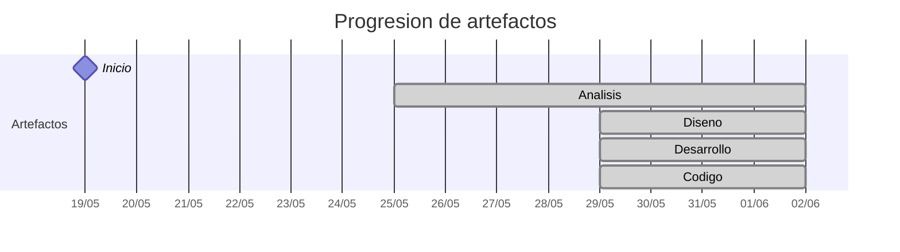

# Timeline - SdeCos

> Repo: [SdeCos/25-26-idsw2-sdVC](https://github.com/SdeCos/25-26-idsw2-sdVC)
> Commits: 13 | Días activos: 9 | Sesiones log: 59

## Patrón observado

| Métrica | Valor |
|---|---|
| Commits propios | 13 (0 feat / 0 fix / 13 other) |
| Días activos | 9 |
| Sesiones documentadas | 59 |
| Sesiones sin fecha en log | 59 |

<!-- trazabilidad: manual -->
## Trazabilidad por caso de uso

| Caso de uso | D7 | D8 | D10 | D11 | D12 |
|---|:---:|:---:|:---:|:---:|:---:|
| `Usuario` | A |   |   | Dd |   |
| `Administrador` |   | A |   |   | Dd |
| `Alumno` |   | A |   |   | Dd |
| `DirectorDeGrado` |   |   | A |   | Dd |
| `Profesor` |   |   | A |   |   |
| `Secretaria` |   |   | A |   |   |

---

## Día 4 · 2026-05-22

### Commits (2: 0 feat / 0 fix)

| Hora | Mensaje |
|---|---|
| 12:03 | [modificacion README, configuracion CLAUDE.md e inicio del conversationlog](https://github.com/SdeCos/25-26-idsw2-sdVC/commit/71a9759b93929716c7aed26dec123825c0acc2da) |
| 11:21 | [QUE_HACE.md](https://github.com/SdeCos/25-26-idsw2-sdVC/commit/295179a1f12d70861963c870cb31121f801fa8c0) |

> ⚠️ Commits sin entrada en log

---

## Día 5 · 2026-05-23

### Commits (1: 0 feat / 0 fix)

| Hora | Mensaje |
|---|---|
| 10:52 | [migracion 00-requisitos, seguimiento de progreso desde README.md y mejora de configuracion de claude](https://github.com/SdeCos/25-26-idsw2-sdVC/commit/d3462b34fc5c494a29780d7a72ec52c888fc674c) |

> ⚠️ Commits sin entrada en log

---

## Día 7 · 2026-05-25

### Commits (2: 0 feat / 0 fix)

| Hora | Mensaje |
|---|---|
| 10:57 | [arreglo cierre sesion requisitado y analisis de CdU de Usuario](https://github.com/SdeCos/25-26-idsw2-sdVC/commit/adfaa319c9ad64f57718a1da00843d80e74f8bd8) |
| 10:07 | [arreglo actores/cdu faltantes del repo anterior, modificacion CLAUDE.md para mejora de contexto](https://github.com/SdeCos/25-26-idsw2-sdVC/commit/2befb6dd24bcca3698b8527b960adfd6a00895b8) |

**Artefactos nuevos:** 🔍 

> ⚠️ Commits sin entrada en log

---

## Día 8 · 2026-05-26

### Commits (1: 0 feat / 0 fix)

| Hora | Mensaje |
|---|---|
| 09:59 | [analisis cdu administrador y alumno](https://github.com/SdeCos/25-26-idsw2-sdVC/commit/df0f91e9a85598d336f8c4f59847d34e28beea5b) |

> ⚠️ Commits sin entrada en log

---

## Día 10 · 2026-05-28

### Commits (3: 0 feat / 0 fix)

| Hora | Mensaje |
|---|---|
| 12:24 | [analisis cdu secretaria](https://github.com/SdeCos/25-26-idsw2-sdVC/commit/55696a6cdce95339e582fc1dcaa2fd192faf90b6) |
| 10:04 | [analisis cdu profesor](https://github.com/SdeCos/25-26-idsw2-sdVC/commit/b5994d6a34cd58521ae3a3dc733b74f65ff4ef60) |
| 09:18 | [analisis cdu director de grado](https://github.com/SdeCos/25-26-idsw2-sdVC/commit/29159538a9fcd6787e9441f17f5f56bddf1e8a10) |

> ⚠️ Commits sin entrada en log

---

## Día 11 · 2026-05-29

### Commits (1: 0 feat / 0 fix)

| Hora | Mensaje |
|---|---|
| 10:51 | [diseno e implementacion usuario](https://github.com/SdeCos/25-26-idsw2-sdVC/commit/8a9f13c4027e6ce79cdee81fd96907e8d339ffb4) |

**Artefactos nuevos:** 🔌 🧩 ⚙️ 

> ⚠️ Commits sin entrada en log

---

## Día 12 · 2026-05-30

### Commits (1: 0 feat / 0 fix)

| Hora | Mensaje |
|---|---|
| 15:37 | [diseno e implementacion administrador, alumno y directordegrado](https://github.com/SdeCos/25-26-idsw2-sdVC/commit/87d694765bc64817ce44c3119332e26979e7cd26) |

> ⚠️ Commits sin entrada en log

---

## Día 14 · 2026-06-01

### Commits (1: 0 feat / 0 fix)

| Hora | Mensaje |
|---|---|
| 09:10 | [diseno e implementacion secretaria](https://github.com/SdeCos/25-26-idsw2-sdVC/commit/bdd0004b0178689062b787d8515e6006f714383d) |

> ⚠️ Commits sin entrada en log

---

## Día 15 · 2026-06-02

### Commits (1: 0 feat / 0 fix)

| Hora | Mensaje |
|---|---|
| 08:48 | [diseno cdu profesor](https://github.com/SdeCos/25-26-idsw2-sdVC/commit/d8fc81492d76d1f8f27e6818e00a7cd593389862) |

> ⚠️ Commits sin entrada en log

---

