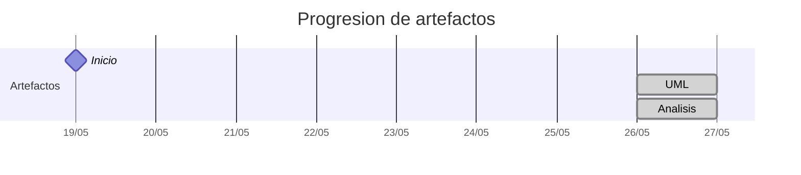

# Timeline - aeRomeroz

> Repo: [aeRomeroz/25-26-idsw2-sdVC](https://github.com/aeRomeroz/25-26-idsw2-sdVC)
> Commits: 5 | Días activos: 3 | Sesiones log: 1

## Patrón observado

| Métrica | Valor |
|---|---|
| Commits propios | 5 (2 feat / 0 fix / 3 other) |
| Días activos | 3 |
| Sesiones documentadas | 1 |
| Sesiones sin fecha en log | 1 |

---

## Día 3 · 2026-05-21

### Commits (1: 0 feat / 0 fix)

| Hora | Mensaje |
|---|---|
| 13:00 | [docs: añadir resúmen del sistema a QUE_HACE.md](https://github.com/aeRomeroz/25-26-idsw2-sdVC/commit/d218732902e13e32f2ef3a5e864526ad0d8f0237) |

> ⚠️ Commits sin entrada en log

---

## Día 4 · 2026-05-22

### Commits (1: 0 feat / 0 fix)

| Hora | Mensaje |
|---|---|
| 12:16 | [rup: creación de carpetas correspondientes al requisitado realizado previamente en Ingeniería del Software 1.](https://github.com/aeRomeroz/25-26-idsw2-sdVC/commit/3906cb7b9c93d6f01bde0008a9a472c0256d2671) |

> ⚠️ Commits sin entrada en log

---

## Día 8 · 2026-05-26

### Commits (3: 2 feat / 0 fix)

| Hora | Mensaje |
|---|---|
| 14:04 | [feat(RUP): alinear artefactos de análisis y limpieza de documentación](https://github.com/aeRomeroz/25-26-idsw2-sdVC/commit/6aefd0aa9432a70d58122dfa3efeb277cf721f0d) |
| 10:18 | [chore: corregir rutas de archivos, imagenes, etc. y crear carpetas para ordenarlos por tipos.](https://github.com/aeRomeroz/25-26-idsw2-sdVC/commit/12c1295023ab15b6475a3b3e5b5fdca9bd97f6e1) |
| 10:17 | [feat: se ha construido un archivo con un set de instrucciones para el modelo de IA, con el propósito de llevar un mejor orden y seguimiento en cada sesión de vibe-coding.](https://github.com/aeRomeroz/25-26-idsw2-sdVC/commit/f88cc6db197df6e349a1bcf459a916da44c18081) |

**Artefactos nuevos:** 📐 🔍 

> ⚠️ Commits sin entrada en log

---

