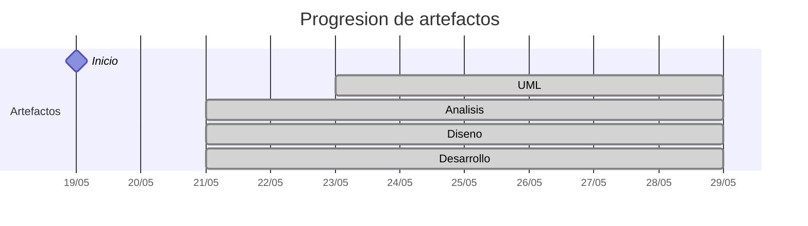

# Timeline - beatriizorozco

> Repo: [beatriizorozco/25-26-idsw2-sdVC](https://github.com/beatriizorozco/25-26-idsw2-sdVC)
> Commits: 17 | Días activos: 6 | Sesiones log: 1

## Patrón observado

| Métrica | Valor |
|---|---|
| Commits propios | 17 (2 feat / 0 fix / 15 other) |
| Días activos | 6 |
| Sesiones documentadas | 1 |
| Sesiones sin fecha en log | 1 |

<!-- trazabilidad: manual -->
## Trazabilidad por caso de uso

| Caso de uso | D6 | D7 |
|---|:---:|:---:|
| *(prototipado — CUs sin nombre en commits; estructura RUP/00-casos-uso)* | A |   |
| *(primera iteración análisis — CUs sin nombre en commits)* |   | A |

---

## Día 3 · 2026-05-21

### Commits (3: 1 feat / 0 fix)

| Hora | Mensaje |
|---|---|
| 01:50 | [chore(repo): organizar estructura inicial del proyecto](https://github.com/beatriizorozco/25-26-idsw2-sdVC/commit/0036b101697c8c9772a70de47243dfc636e450be) |
| 01:28 | [feat(codex): agregar skill session-memory](https://github.com/beatriizorozco/25-26-idsw2-sdVC/commit/fe592bf71c1ecd276f26a2d7f5fb660fe5f30030) |
| 17:45 | [docs: añadir especificación inicial del proyecto](https://github.com/beatriizorozco/25-26-idsw2-sdVC/commit/06bf7c3e4f9e20631e9d2d522d24639d170ef282) |

**Artefactos nuevos:** 🔍 🧩 ⚙️ 

> ⚠️ Commits sin entrada en log

---

## Día 4 · 2026-05-22

### Commits (2: 0 feat / 0 fix)

| Hora | Mensaje |
|---|---|
| 01:08 | [test(session-memory): corrección errata](https://github.com/beatriizorozco/25-26-idsw2-sdVC/commit/6ac06db28ce6bbbcd150a25b564b723d85bd7cdd) |
| 00:50 | [test(session-memory): verificar actualización de conversation-log](https://github.com/beatriizorozco/25-26-idsw2-sdVC/commit/fe8321c8890610de12c5525ad223ac739146c217) |

> ⚠️ Commits sin entrada en log

---

## Día 5 · 2026-05-23

### Commits (2: 0 feat / 0 fix)

| Hora | Mensaje |
|---|---|
| 02:15 | [Remove detailed logs of naming and link adjustments](https://github.com/beatriizorozco/25-26-idsw2-sdVC/commit/5b903142f0fe3eb4d89ccb8c49c54bf4ea449d0f) |
| 02:14 | [refactor(rup): organizo en este nuevo repositorio RUP/00-casos-uso](https://github.com/beatriizorozco/25-26-idsw2-sdVC/commit/e9ffc30f7c68093b4efde43847f049fbc3d9e110) |

**Artefactos nuevos:** 📐 

> ⚠️ Commits sin entrada en log

---

## Día 6 · 2026-05-24

### Commits (5: 0 feat / 0 fix)

| Hora | Mensaje |
|---|---|
| 00:01 | [Update context diagrams and actor states](https://github.com/beatriizorozco/25-26-idsw2-sdVC/commit/fcf3bee3de895dcfd1b005253de6bc7ebb1eef8e) |
| 22:15 | [Merge branch 'develop' of https://github.com/beatriizorozco/25-26-idsw2-sdVC into develop](https://github.com/beatriizorozco/25-26-idsw2-sdVC/commit/ebb0c04561cf85aaa74bf4359d205f0211f413b3) |
| 22:15 | [docs: actualizar README y cerrar conversation-log de la sesión](https://github.com/beatriizorozco/25-26-idsw2-sdVC/commit/3ac492ba6d4f5eab271a04f7898fae4eca1fdb43) |
| 21:59 | [docs: actualizar README principal de 00-casos-uso](https://github.com/beatriizorozco/25-26-idsw2-sdVC/commit/053cd6c46aa45c04214a163d265e6423835e45ee) |
| 21:47 | [añado el prototipado de los casos de uso](https://github.com/beatriizorozco/25-26-idsw2-sdVC/commit/938dbdd4b9bb67ceb494fd6213a4c146709546d4) |

> ⚠️ Commits sin entrada en log

---

## Día 7 · 2026-05-25

### Commits (4: 1 feat / 0 fix)

| Hora | Mensaje |
|---|---|
| 21:44 | [docs: finalizar sesión y sincronizar conversation-log](https://github.com/beatriizorozco/25-26-idsw2-sdVC/commit/a65ff6749106744abfe79274e04371e7a7a5d935) |
| 21:38 | [feat: primera iteración de análisis](https://github.com/beatriizorozco/25-26-idsw2-sdVC/commit/4cf6ae0b726299bec7d4ddfd41b04f5999e9764b) |
| 18:07 | [docs: corrijo minúsculas](https://github.com/beatriizorozco/25-26-idsw2-sdVC/commit/b3835699adc10ea6e8cafa04cc14149c7144d074) |
| 17:56 | [docs: actualizar README de detallado y prototipos usando plantilla pySighor](https://github.com/beatriizorozco/25-26-idsw2-sdVC/commit/fa674518d9a0c1c68f1856dd6d206736472acf40) |

> ⚠️ Commits sin entrada en log

---

## Día 11 · 2026-05-29

### Commits (1: 0 feat / 0 fix)

| Hora | Mensaje |
|---|---|
| 12:04 | [Merge pull request #1 from beatriizorozco/develop](https://github.com/beatriizorozco/25-26-idsw2-sdVC/commit/33d3d457759c1ef0f214a08deefcfeae00d6e4a5) |

> ⚠️ Commits sin entrada en log

---

