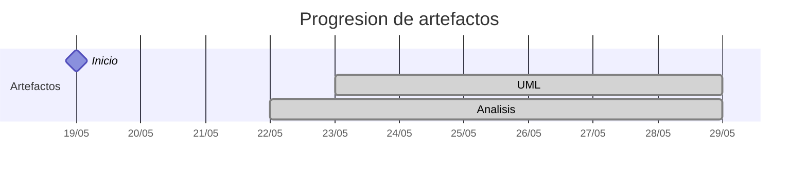

# Timeline - carlos-alvarado-25

> Repo: [carlos-alvarado-25/25-26-idsw2-sdVC](https://github.com/carlos-alvarado-25/25-26-idsw2-sdVC)
> Commits: 38 | Días activos: 8 | Sesiones log: 17

## Patrón observado

| Métrica | Valor |
|---|---|
| Commits propios | 38 (32 feat / 3 fix / 3 other) |
| Ratio fix/feat | 0.09 |
| Días activos | 8 |
| Sesiones documentadas | 17 |
| Días log+commits | 2 |
| Días solo log | 0 |
| Días solo commits | 6 |
| Sesiones sin fecha en log | 9 |

<!-- trazabilidad: manual -->
## Trazabilidad por caso de uso

| Caso de uso | D4 | D5 | D6 | D7 | D8 | D9 | D10 |
|---|:---:|:---:|:---:|:---:|:---:|:---:|:---:|
| `importarGrados` | A |   |   |   |   |   |   |
| `crearGrado` |   | A |   |   |   |   |   |
| `editarGrado` |   |   | A |   |   |   |   |
| `eliminarGrado` |   |   | A |   |   |   |   |
| `abrirExamenes` |   |   | A |   |   |   |   |
| `crearExamen` |   |   | A |   |   |   |   |
| `editarExamen` |   |   | A |   |   |   |   |
| `eliminarExamen` |   |   | A |   |   |   |   |
| `abrirAsignaturas` |   |   |   | A |   |   |   |
| `importarAsignaturas` |   |   |   | A |   |   |   |
| `crearAsignatura` |   |   |   | A |   |   |   |
| `editarAsignatura` |   |   |   | A |   |   |   |
| `eliminarAsignatura` |   |   |   | A |   |   |   |
| `abrirProfesores` |   |   |   |   | A |   |   |
| `importarProfesores` |   |   |   |   | A |   |   |
| `crearProfesor` |   |   |   |   | A |   |   |
| `editarProfesor` |   |   |   |   | A |   |   |
| `eliminarProfesor` |   |   |   |   | A |   |   |
| `listarConflictosExamenes` |   |   |   |   | A |   |   |
| `abrirAulas` |   |   |   |   |   | A |   |
| `importarAulas` |   |   |   |   |   | A |   |
| `crearAula` |   |   |   |   |   | A |   |
| `editarAula` |   |   |   |   |   | A |   |
| `eliminarAula` |   |   |   |   |   | A |   |
| `abrirAlumnos` |   |   |   |   |   |   | A |
| `importarAlumnos` |   |   |   |   |   |   | A |
| `crearAlumno` |   |   |   |   |   |   | A |
| `editarAlumno` |   |   |   |   |   |   | A |
| `eliminarAlumno` |   |   |   |   |   |   | A |

---

## Día 3 · 2026-05-21

### Commits (4: 3 feat / 0 fix)

| Hora | Mensaje |
|---|---|
| 19:49 | [feat: Cierre de preparación del entorno RUP](https://github.com/carlos-alvarado-25/25-26-idsw2-sdVC/commit/43e463dbfb6c5fc18178ca9944e93058d17a1cd9) |
| 19:39 | [feat: Estructurando directorios de imágenes para limpiar directorios de RUP/ y de images/](https://github.com/carlos-alvarado-25/25-26-idsw2-sdVC/commit/4579322391bc275725dcc086ea87fa6a21b2517d) |
| 19:19 | [feat: Añadiendo requisitado desde el repo de IdSw 1](https://github.com/carlos-alvarado-25/25-26-idsw2-sdVC/commit/aac398986d1f0b1ebbb38c6bc7d885ef74e58304) |
| 13:18 | [initial commit - QUE_HACE.md](https://github.com/carlos-alvarado-25/25-26-idsw2-sdVC/commit/e182ed8642caaeb3defbb831bff0368d0f94dc2c) |

> ⚠️ Commits sin entrada en log

---

## Día 4 · 2026-05-22

### Commits (1: 1 feat / 0 fix)

| Hora | Mensaje |
|---|---|
| 17:47 | [feat: Añadir análisis y documentación para el caso de uso importarGrados y configuraciones adicionales para gemini-cli](https://github.com/carlos-alvarado-25/25-26-idsw2-sdVC/commit/ab00726fa9c9d13e772a6d3420818a1a1a5687a6) |

**Artefactos nuevos:** 🔍 

> ⚠️ Commits sin entrada en log

---

## Día 5 · 2026-05-23

### Commits (3: 2 feat / 1 fix)

| Hora | Mensaje |
|---|---|
| 15:06 | [feat: Añadir análisis y documentación para el caso de uso crearGrado, incluyendo diagramas de colaboración y clases de análisis](https://github.com/carlos-alvarado-25/25-26-idsw2-sdVC/commit/03aa02c6857fbbe54812cd3e4a61c0b220e77ffe) |
| 13:33 | [fix: Reestructuración de directorios de imagenes y modelosUML, y corrección de enlaces para asegurar la integridad de la estructura del repositorio](https://github.com/carlos-alvarado-25/25-26-idsw2-sdVC/commit/a679757f55c682e4c735995e1e3c4d704a94098b) |
| 12:16 | [Add new images and analysis diagrams for various functionalities in the project](https://github.com/carlos-alvarado-25/25-26-idsw2-sdVC/commit/a315ef19878f904b193145a02a66c0f5c8ba79fe) |

**Artefactos nuevos:** 📐 

> ⚠️ Commits sin entrada en log

---

## Día 6 · 2026-05-24

### Commits (9: 8 feat / 1 fix)

| Hora | Mensaje |
|---|---|
| 17:46 | [fix: Refactor SVG diagram for analysis](https://github.com/carlos-alvarado-25/25-26-idsw2-sdVC/commit/230454e0aff8bad7f0c2838af4f745897e4cb7f7) |
| 15:44 | [feat: add analysis and documentation for eliminarExamen use case, including sampling integrity and collaboration diagram](https://github.com/carlos-alvarado-25/25-26-idsw2-sdVC/commit/7b381a07dc08f8b6d5aa3741d485c20626187467) |
| 15:42 | [feat: add analysis and documentation for eliminarExamen use case, including collaboration diagram](https://github.com/carlos-alvarado-25/25-26-idsw2-sdVC/commit/7b40f50f1f99b91269880d03fdd32f7a55a357d0) |
| 15:26 | [feat: add editarExamen case use analysis and collaboration diagram](https://github.com/carlos-alvarado-25/25-26-idsw2-sdVC/commit/0a411726358370dde29ea5255d9b34015c1c21fe) |
| 15:03 | [feat: Add analysis for crearExamen use case](https://github.com/carlos-alvarado-25/25-26-idsw2-sdVC/commit/a13c10cf654a84af531f7032cf47da685e3a0faa) |
| 14:29 | [feat: Añadir sesión extraordinaria sobre refinamiento de entidades conceptuales y uso de PagedResult en el análisis](https://github.com/carlos-alvarado-25/25-26-idsw2-sdVC/commit/459b52c92a25cb3457f8bf4af37b30eab2f7e9b3) |
| 14:15 | [feat: Add analysis for abrirExamenes use case and related documentation](https://github.com/carlos-alvarado-25/25-26-idsw2-sdVC/commit/c7817dba7660edec72c9c098f5586f7db78f9431) |
| 12:24 | [feat: Añadir análisis y documentación para el caso de uso eliminarGrado, incluyendo diagrama de colaboración y validación de dependencias](https://github.com/carlos-alvarado-25/25-26-idsw2-sdVC/commit/7cdf015bc933f0116e267c67dead2a6677e21459) |
| 12:05 | [feat: Añadir análisis y documentación para el caso de uso editarGrado, incluyendo diagrama de colaboración y corrección del conversation-log para añadir fecha y hora](https://github.com/carlos-alvarado-25/25-26-idsw2-sdVC/commit/d389a311809472254baaa89c2b95d52b6635125d) |

> ⚠️ Commits sin entrada en log

---

## Día 7 · 2026-05-25

### Commits (6: 5 feat / 1 fix)

| Hora | Mensaje |
|---|---|
| 17:12 | [feat: Add analysis and documentation for eliminarAsignatura use case, including collaboration diagram and impact control](https://github.com/carlos-alvarado-25/25-26-idsw2-sdVC/commit/9f2f9e0a72df8c0aa93c3b55fa3ae931a9c405ee) |
| 16:48 | [Add analysis diagrams for 'editarAsignatura' use case and update 'crearAsignatura' collaboration diagram](https://github.com/carlos-alvarado-25/25-26-idsw2-sdVC/commit/7305cc7ff1f42b53059e0b22d47685ca4d85e194) |
| 14:26 | [feat: Add crearAsignatura use case analysis and related documentation](https://github.com/carlos-alvarado-25/25-26-idsw2-sdVC/commit/00fbf4996d647fa159073c03e748473f1dd7d9ac) |
| 13:30 | [feat: Add analysis and documentation for importarAsignaturas use case, including collaboration diagram and dependency resolution](https://github.com/carlos-alvarado-25/25-26-idsw2-sdVC/commit/578ffce0e2426a007d119e58a8bdd8732b7b57a2) |
| 12:47 | [feat: Add analysis for abrirAsignaturas use case and update documentation](https://github.com/carlos-alvarado-25/25-26-idsw2-sdVC/commit/1b51ccac8643198d5d08e766c36e127d24e43d65) |
| 12:03 | [fix: update session numbering in conversation log for clarity](https://github.com/carlos-alvarado-25/25-26-idsw2-sdVC/commit/f618f4aae79954bf2a6f5eb36c49acde7572820c) |

> ⚠️ Commits sin entrada en log

---

## Día 8 · 2026-05-26

### Commits (6: 5 feat / 0 fix)

| Hora | Mensaje |
|---|---|
| 22:47 | [feat: Add analysis and documentation for eliminarProfesor use case, including collaboration diagram and related files](https://github.com/carlos-alvarado-25/25-26-idsw2-sdVC/commit/0c49f058e8c5d2457496fc654e80c6d474d04b22) |
| 22:29 | [Refactor UML diagrams for exam conflict management and professor assignment](https://github.com/carlos-alvarado-25/25-26-idsw2-sdVC/commit/7ea7ab10103f2c8b13ae1d82bda07fdb0a5b3f89) |
| 21:18 | [feat: Add analysis documentation and collaboration diagram for listarConflictosExamenes use case](https://github.com/carlos-alvarado-25/25-26-idsw2-sdVC/commit/11e44f48267762094b068f92647915df54a5ff08) |
| 20:52 | [feat: Add editarProfesor case use analysis and documentation](https://github.com/carlos-alvarado-25/25-26-idsw2-sdVC/commit/a8dc577b49b020f42645757be86dca3708769bf9) |
| 20:40 | [feat: Add analysis and documentation for crearProfesor use case, including collaboration diagram and related files](https://github.com/carlos-alvarado-25/25-26-idsw2-sdVC/commit/0e3dc1a9f31c461f500f2e5756335cee78b580e0) |
| 20:17 | [feat: Add analysis documentation and UML diagrams for abrirProfesores and importarProfesores use cases](https://github.com/carlos-alvarado-25/25-26-idsw2-sdVC/commit/5668985d88e588ae1adbd63b82781d3cce6ca81a) |

> ⚠️ Commits sin entrada en log

---

## Día 9 · 2026-05-27

### Commits (4: 3 feat / 0 fix)

| Hora | Mensaje |
|---|---|
| 23:08 | [feat: Implementar análisis y diagramas para editarAula y eliminarAula](https://github.com/carlos-alvarado-25/25-26-idsw2-sdVC/commit/e7f4b32626b2276227a69873b8d4d703f79d824f) |
| 22:18 | [feat: Add analysis documentation and collaboration diagram for importarAulas use case](https://github.com/carlos-alvarado-25/25-26-idsw2-sdVC/commit/292d1ef2fe2ad39a58b18df477907bff8cc2ea93) |
| 20:54 | [feat: Add analysis documentation and collaboration diagrams for abrirAulas and crearAula use cases](https://github.com/carlos-alvarado-25/25-26-idsw2-sdVC/commit/82be3f90dba2e76b5a624c05f03cba15227abd60) |
| 20:37 | [Refactor use case diagrams for editing entities](https://github.com/carlos-alvarado-25/25-26-idsw2-sdVC/commit/a47154ad0208f80f98205c0110351b3e20878e9a) |

### 💬 Conversation-log (3 sesiónes)

- Sesión 26: Rama de Aulas - Estandarización de Importación
- Sesión 27: Blindaje de Protocolos y Cierre de Jornada
- Sesión 28: Rama de Aulas - Refinamiento y Consistencia Semántica

> 💬 + commits = proceso documentado

---

## Día 10 · 2026-05-28

### Commits (5: 5 feat / 0 fix)

| Hora | Mensaje |
|---|---|
| 23:37 | [feat: Add analysis documentation and collaboration diagram for eliminarAlumno use case](https://github.com/carlos-alvarado-25/25-26-idsw2-sdVC/commit/dfb7c70366a462381bf7db2e9c0333a9ea26dae5) |
| 23:18 | [feat: Add analysis documentation and collaboration diagram for editarAlumno use case](https://github.com/carlos-alvarado-25/25-26-idsw2-sdVC/commit/205dad5d7b850384f1b82601e3c62f2c35835886) |
| 22:48 | [feat: Added analysis documentation for crearAlumnos use case and diagrams](https://github.com/carlos-alvarado-25/25-26-idsw2-sdVC/commit/c6d0b8b3724329335ceb08a7e118512e2f5a45f8) |
| 21:14 | [feat: Add analysis documentation and collaboration diagram for importarAlumnos use case](https://github.com/carlos-alvarado-25/25-26-idsw2-sdVC/commit/c7a1dd5b71d84cef35bb4c82fedd31056e9f5506) |
| 09:38 | [feat: Add analysis for use case abrirAlumnos and corrected listing method on abrir entities](https://github.com/carlos-alvarado-25/25-26-idsw2-sdVC/commit/b8e5c6be68003d41ef3487c8f84d91ff68870e48) |

### 💬 Conversation-log (5 sesiónes)

- Sesión 29: Rama de Alumnos y Estandarización Global de Listados
- Sesión 30: Rama de Alumnos - Importación y Resolución de Dependencias
- Sesión 31: Rama de Alumnos - Creación Manual y Vinculación Académica
- Sesión 32: Rama de Alumnos - Edición y Navegación por Estados
- Sesión 33: Rama de Alumnos - Eliminación y Rigor de Requisitos

> 💬 + commits = proceso documentado

---

