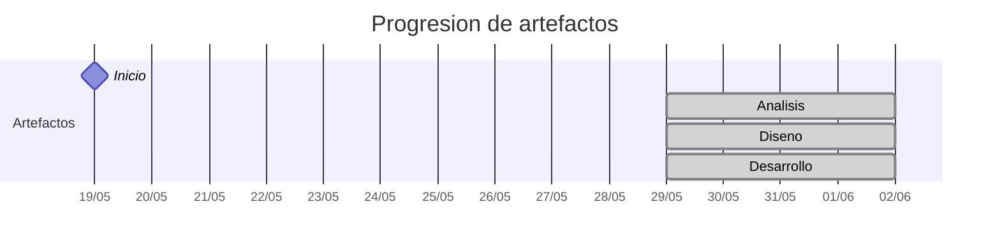

# Timeline - eirik-rosete

> Repo: [eirik-rosete/25-26-idsw2-sdVC](https://github.com/eirik-rosete/25-26-idsw2-sdVC)
> Commits: 8 | Días activos: 5 | Sesiones log: 3

## Patrón observado

| Métrica | Valor |
|---|---|
| Commits propios | 8 (6 feat / 2 fix / 0 other) |
| Ratio fix/feat | 0.33 |
| Días activos | 5 |
| Sesiones documentadas | 3 |
| Días log+commits | 2 |
| Días solo log | 1 |
| Días solo commits | 3 |

---

## Día 3 · 2026-05-21

### Commits (1: 1 feat / 0 fix)

| Hora | Mensaje |
|---|---|
| 13:15 | [feat: Answering what the system does in the QUE_HACE.md file.](https://github.com/eirik-rosete/25-26-idsw2-sdVC/commit/98d3c1ae20c3425298c13ce6e5a0ea5c83c90120) |

> ⚠️ Commits sin entrada en log

---

## Día 11 · 2026-05-29

### Commits (1: 1 feat / 0 fix)

| Hora | Mensaje |
|---|---|
| 04:03 | [feat: agregando contexto en carpeta RUP y ajustando el contexto a la IA para la generación de registros y elaboración de vibe coding de manera metódica y supervisada](https://github.com/eirik-rosete/25-26-idsw2-sdVC/commit/b261ac880d4a7d109f49ca0f79f5d4fd3b5a081d) |

### 💬 Conversation-log (1 sesión)

- Consolidación de Identidad y Restricciones de Ejecución

**Artefactos nuevos:** 🔍 🧩 ⚙️ 

> 💬 + commits = proceso documentado

---

## Día 12 · 2026-05-30

### Commits (1: 1 feat / 0 fix)

| Hora | Mensaje |
|---|---|
| 18:56 | [feat: actualizando GEMINI.md para ser más específico](https://github.com/eirik-rosete/25-26-idsw2-sdVC/commit/6c9f495e22f295ab4ca9b2cb757a2e8e8cce7a3c) |

> ⚠️ Commits sin entrada en log

---

## Día 13 · 2026-05-31

### Commits (3: 1 feat / 2 fix)

| Hora | Mensaje |
|---|---|
| 01:54 | [feat: añadiendo casos de uso correspondientes a las entidades Region y Planta](https://github.com/eirik-rosete/25-26-idsw2-sdVC/commit/ff0cb81ca01600db4742cf33dffdbdeffe89fe68) |
| 20:00 | [fix: actualizando GEMINI.md para que sea fiel a QUE_HACE.md y considere la rúbrica](https://github.com/eirik-rosete/25-26-idsw2-sdVC/commit/6039da11422be07fe971cf2b9379bac45a4ad18a) |
| 19:53 | [fix: arreglando GEMINI.md para que la información sobre el sistema sea congruente](https://github.com/eirik-rosete/25-26-idsw2-sdVC/commit/772084611a380432c2cd2e156f87458d1cc39ef9) |

> ⚠️ Commits sin entrada en log

---

## Día 14 · 2026-06-01

### Commits (2: 2 feat / 0 fix)

| Hora | Mensaje |
|---|---|
| 00:34 | [feat: agregando los casos de uso de region y planta](https://github.com/eirik-rosete/25-26-idsw2-sdVC/commit/f8825d9b737d10fb2836a72ff90079841ae8353d) |
| 23:52 | [feat: modificando README.md de la raíz del proyecto de manera mínima](https://github.com/eirik-rosete/25-26-idsw2-sdVC/commit/3b37c333b2cc4001e577a34e6231ee546ccd97eb) |

### 💬 Conversation-log (1 sesión)

- Sesión 2 - Auditoría de Casos de Uso y Adición de CRUD Jerárquico

> 💬 + commits = proceso documentado

---

## Día 15 · 2026-06-02

### 💬 Conversation-log (1 sesión)

- Detallado y Prototipado de CRUD para Región y Planta

> ⚠️ Log sin commits

---

