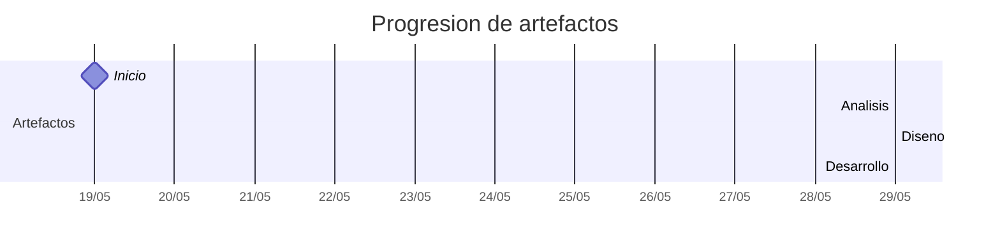

# Timeline - eirik-rosete

> Repo: [eirik-rosete/25-26-idsw2-sdVC](https://github.com/eirik-rosete/25-26-idsw2-sdVC)
> Commits: 2 | Días activos: 2 | Sesiones log: 1

## Patrón observado

| Métrica | Valor |
|---|---|
| Commits propios | 2 (2 feat / 0 fix / 0 other) |
| Días activos | 2 |
| Sesiones documentadas | 1 |
| Días log+commits | 1 |
| Días solo log | 0 |
| Días solo commits | 1 |

---

## Día 3 · 2026-05-21

### Commits (1: 1 feat / 0 fix)

| Hora | Mensaje |
|---|---|
| 13:15 | [feat: Answering what the system does in the QUE_HACE.md file.](https://github.com/eirik-rosete/25-26-idsw2-sdVC/commit/98d3c1ae20c3425298c13ce6e5a0ea5c83c90120) |

> ⚠️ Commits sin entrada en log

---

## Día 11 · 2026-05-29

### Commits (1: 1 feat / 0 fix)

| Hora | Mensaje |
|---|---|
| 04:03 | [feat: agregando contexto en carpeta RUP y ajustando el contexto a la IA para la generación de registros y elaboración de vibe coding de manera metódica y supervisada](https://github.com/eirik-rosete/25-26-idsw2-sdVC/commit/b261ac880d4a7d109f49ca0f79f5d4fd3b5a081d) |

### 💬 Conversation-log (1 sesión)

- Consolidación de Identidad y Restricciones de Ejecución

**Artefactos nuevos:** 🔍 🧩 ⚙️ 

> 💬 + commits = proceso documentado

---

