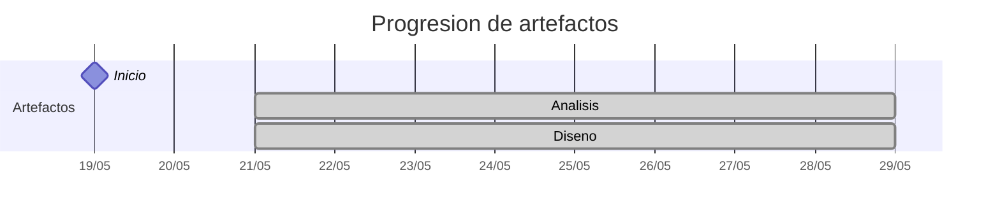

# Timeline - franvenero

> Repo: [franvenero/25-26-idsw2-sdVC](https://github.com/franvenero/25-26-idsw2-sdVC)
> Commits: 13 | Días activos: 6 | Sesiones log: 11

## Patrón observado

| Métrica | Valor |
|---|---|
| Commits propios | 13 (1 feat / 1 fix / 11 other) |
| Ratio fix/feat | 1.00 |
| Días activos | 6 |
| Sesiones documentadas | 11 |
| Días log+commits | 4 |
| Días solo log | 0 |
| Días solo commits | 2 |

## Trazabilidad por caso de uso

| Caso de uso | D3 |
|---|:---:|
| `casos-uso` | A |

---

## Día 3 · 2026-05-21

### Commits (3: 0 feat / 0 fix)

| Hora | Mensaje |
|---|---|
| 23:56 | [docs: análisis BCE para iniciarSesion, cerrarSesion y completarGestion](https://github.com/franvenero/25-26-idsw2-sdVC/commit/cd1ff3f85f43d5ed44d86a6e4bf91258e160f24c) |
| 22:08 | [docs: define estructura de artefactos RUP en analisis y diseño](https://github.com/franvenero/25-26-idsw2-sdVC/commit/6bfdb57300c8f5ef1a50b71db760b0f4cab06259) |
| 20:14 | [docs: commit inicial QUE_HACE.md](https://github.com/franvenero/25-26-idsw2-sdVC/commit/be29d0f3d5ad3242f581f687e7103ee9d03d59ef) |

### 💬 Conversation-log (4 sesiónes)

- Estructuración del marco de trabajo RUP
- Documentación y preparación de modelos RUP
- Modelado de análisis para Gestión de Sesión y Coordinación
- Configuración de asistente de versionado profesional

**Artefactos nuevos:** 🔍 🧩 

> 💬 + commits = proceso documentado

---

## Día 5 · 2026-05-23

### Commits (2: 0 feat / 0 fix)

| Hora | Mensaje |
|---|---|
| 17:50 | [chore: Organizar estructura de casos de uso en módulos funcionales (RUP)](https://github.com/franvenero/25-26-idsw2-sdVC/commit/6bb48ca10b4e4e7c72a6df063e68e208c09cf9b9) |
| 12:27 | [docs: análisis BCE completo para el módulo de Gestión de Tareas](https://github.com/franvenero/25-26-idsw2-sdVC/commit/f5a8392e819485608b275ed74c7697bca678290e) |

### 💬 Conversation-log (3 sesiónes)

- Análisis RUP para el módulo de Gestión de Tareas
- Extensión del Análisis RUP: Navegación, Relaciones y Validaciones
- Organización Modular de Análisis RUP

> 💬 + commits = proceso documentado

---

## Día 6 · 2026-05-24

### Commits (4: 1 feat / 0 fix)

| Hora | Mensaje |
|---|---|
| 12:35 | [feat: inicializar estructura y arquitectura de la Fase 2 (Diseño) RUP](https://github.com/franvenero/25-26-idsw2-sdVC/commit/9769edcfefe7f5597bc5605913e1408e0dc39961) |
| 11:15 | [docs: actualizar decisión final en el log de conversación](https://github.com/franvenero/25-26-idsw2-sdVC/commit/458514087fe0a10ac91736e22280b052ec97de7c) |
| 11:13 | [docs: cierre de Fase 1 (Análisis) con el módulo de Planificación y Configuración](https://github.com/franvenero/25-26-idsw2-sdVC/commit/4b09599c96e403ba096d17ae4f76a0359e82e057) |
| 11:01 | [docs: análisis BCE completo para el módulo de Gestión de Grupos](https://github.com/franvenero/25-26-idsw2-sdVC/commit/faaf14d5523b8d43ac487e31363464126154a6dd) |

### 💬 Conversation-log (3 sesiónes)

- Análisis RUP: Gestión de Grupos
- Cierre de Fase 1 (Análisis): Planificación y Configuración
- Inicio de Fase 2 (Diseño): Arquitectura y Estructura

> 💬 + commits = proceso documentado

---

## Día 7 · 2026-05-25

### Commits (2: 0 feat / 0 fix)

| Hora | Mensaje |
|---|---|
| 20:19 | [docs: purificacion completa de Fase 1 (Analisis) bajo estandar Gold Standard](https://github.com/franvenero/25-26-idsw2-sdVC/commit/9bf54f653c37ad0fc530b9e66c75607062ee4dcc) |
| 19:48 | [docs: auditoria de rigor RUP y actualizacion de protocolo para iniciarSesion](https://github.com/franvenero/25-26-idsw2-sdVC/commit/9edec1a10b7606d101be4595cdecf5f727b98883) |

> ⚠️ Commits sin entrada en log

---

## Día 9 · 2026-05-27

### Commits (1: 0 feat / 1 fix)

| Hora | Mensaje |
|---|---|
| 17:02 | [fix: subida de archivos erronea anteriormente](https://github.com/franvenero/25-26-idsw2-sdVC/commit/c5e052affa8564b1f8d3eae53470c6c8d3c90767) |

> ⚠️ Commits sin entrada en log

---

## Día 11 · 2026-05-29

### Commits (1: 0 feat / 0 fix)

| Hora | Mensaje |
|---|---|
| 16:59 | [docs: define stack tecnológico y establece nuevo protocolo de registro dual](https://github.com/franvenero/25-26-idsw2-sdVC/commit/7ab4d4c694e8a33d763b583313446e61a8fcc0bc) |

### 💬 Conversation-log (1 sesión)

- Establecimiento de Protocolo de Registro Dual

> 💬 + commits = proceso documentado

---

