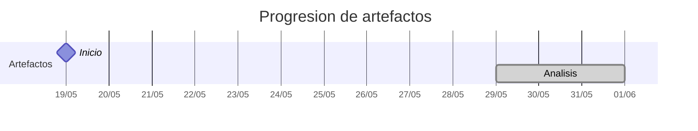

# Timeline - inigovaqueroo04

> Repo: [inigovaqueroo04/25-26-idsw2-sdVC](https://github.com/inigovaqueroo04/25-26-idsw2-sdVC)
> Commits: 22 | Días activos: 6 | Sesiones log: 0

## Patrón observado

| Métrica | Valor |
|---|---|
| Commits propios | 22 (2 feat / 0 fix / 20 other) |
| Días activos | 6 |
| Sesiones documentadas | 0 |

<!-- trazabilidad: manual -->
## Trazabilidad por caso de uso

| Caso de uso | D7 | D8 | D9 | D11 |
|---|:---:|:---:|:---:|:---:|
| `iniciarSesion` | A |   |   |   |
| `cerrarSesion` |   | A |   |   |
| `completarGestion` |   | A |   |   |
| `abrirGrupos` |   | A |   |   |
| `crearGrupo` |   | A |   |   |
| `editarGrupo` |   | A |   |   |
| `eliminarGrupo` |   | A |   |   |
| `invitarUsuario` |   | A |   |   |
| `editarMiembro` |   | A |   |   |
| `eliminarMiembro` |   |   | A |   |
| `abrirInvitaciones` |   |   |   | A |
| `editarInvitacion` |   |   |   | A |
| `abrirTareas` |   |   |   | A |

---

## Día 3 · 2026-05-21

### Commits (1: 1 feat / 0 fix)

| Hora | Mensaje |
|---|---|
| 13:05 | [feat: QUE_HACE](https://github.com/inigovaqueroo04/25-26-idsw2-sdVC/commit/54902be9450fc6d64fe30d7eb4b8d20d0b446319) |

> ⚠️ Commits sin entrada en log

---

## Día 7 · 2026-05-25

### Commits (2: 1 feat / 0 fix)

| Hora | Mensaje |
|---|---|
| 20:21 | [docs(analisis): agregar analisis iniciarSesion](https://github.com/inigovaqueroo04/25-26-idsw2-sdVC/commit/89adfd935ef67ca70b0759c984df2856523af526) |
| 19:26 | [feat: protocolo sesiones ia](https://github.com/inigovaqueroo04/25-26-idsw2-sdVC/commit/cc8831f47ca92f60749c114d8678e6f1ab4b9ffd) |

> ⚠️ Commits sin entrada en log

---

## Día 8 · 2026-05-26

### Commits (9: 0 feat / 0 fix)

| Hora | Mensaje |
|---|---|
| 00:20 | [Analiza caso de uso editarMiembro](https://github.com/inigovaqueroo04/25-26-idsw2-sdVC/commit/af69e5d23fca74827f8d9312d044b86e0876811b) |
| 22:06 | [Analiza caso de uso invitarUsuario](https://github.com/inigovaqueroo04/25-26-idsw2-sdVC/commit/dbe73551db2f5dc6373e8a099593b20d97adc11c) |
| 21:44 | [Analiza caso de uso eliminarGrupo](https://github.com/inigovaqueroo04/25-26-idsw2-sdVC/commit/968b4541cef29f952c505023120e0aa3983ec0e4) |
| 21:29 | [Analiza caso de uso editarGrupo](https://github.com/inigovaqueroo04/25-26-idsw2-sdVC/commit/22969327a95afc86774809f35e7ff2c53d94c8d4) |
| 21:18 | [Analiza caso de uso crearGrupo](https://github.com/inigovaqueroo04/25-26-idsw2-sdVC/commit/84b36b1c7d9a9c336503b7587d0df48ee314aa75) |
| 20:54 | [Analiza caso de uso abrirGrupos](https://github.com/inigovaqueroo04/25-26-idsw2-sdVC/commit/62aa300d891e810cfa5109c1b21cdf62202fab26) |
| 20:45 | [Actualiza README principal de Breñotask](https://github.com/inigovaqueroo04/25-26-idsw2-sdVC/commit/7d350df8dc5c89d16436568a4d9c2da0a87e858f) |
| 16:12 | [docs(analisis): documentar completarGestion desde SdR](https://github.com/inigovaqueroo04/25-26-idsw2-sdVC/commit/52aa8a9d1f10113a1c55e2cb3571b2150bc18509) |
| 15:30 | [docs(analisis): documentar cerrarSesion desde SdR](https://github.com/inigovaqueroo04/25-26-idsw2-sdVC/commit/c02b8fc538f30a98e34a235ceea3b86ab513026f) |

> ⚠️ Commits sin entrada en log

---

## Día 9 · 2026-05-27

### Commits (1: 0 feat / 0 fix)

| Hora | Mensaje |
|---|---|
| 15:29 | [docs: analiza caso de uso eliminarMiembro](https://github.com/inigovaqueroo04/25-26-idsw2-sdVC/commit/573175b11498f282bc6f405fb4ac966912d0c669) |

> ⚠️ Commits sin entrada en log

---

## Día 11 · 2026-05-29

### Commits (5: 0 feat / 0 fix)

| Hora | Mensaje |
|---|---|
| 19:25 | [docs: analiza caso de uso abrirTareas](https://github.com/inigovaqueroo04/25-26-idsw2-sdVC/commit/217b0e029bd395415c4f97f9ff31d69f19df5c23) |
| 19:01 | [docs: añade pendientes de diseño e implementación](https://github.com/inigovaqueroo04/25-26-idsw2-sdVC/commit/9e032f3b9b0039bd1f80b8a2115cdd3651b5b544) |
| 18:38 | [docs: analiza caso de uso editarInvitacion](https://github.com/inigovaqueroo04/25-26-idsw2-sdVC/commit/a7dabd4c56691a369eeb849bd947f2a990ec473e) |
| 18:32 | [docs: analiza caso de uso abrirInvitaciones](https://github.com/inigovaqueroo04/25-26-idsw2-sdVC/commit/3cb80cb5be272b6355a439340cbd47c6c785a8d6) |
| 18:10 | [Normaliza carpeta de documentos](https://github.com/inigovaqueroo04/25-26-idsw2-sdVC/commit/98e27bc82798e0b938dfd785cbce4168ebba1016) |

**Artefactos nuevos:** 🔍 

> ⚠️ Commits sin entrada en log

---

## Día 13 · 2026-05-31

### Commits (4: 0 feat / 0 fix)

| Hora | Mensaje |
|---|---|
| 00:13 | [docs: analiza caso de uso eliminarTarea](https://github.com/inigovaqueroo04/25-26-idsw2-sdVC/commit/75413a0c620814a635900e504e3e3ac6fcf26af3) |
| 21:01 | [docs: analiza caso de uso relacionarTareas](https://github.com/inigovaqueroo04/25-26-idsw2-sdVC/commit/32906626260aa89d06be9419ea57eb67635f8001) |
| 20:49 | [docs: analiza caso de uso editarTarea](https://github.com/inigovaqueroo04/25-26-idsw2-sdVC/commit/49bf63a37f375c487b5c1f367de33a37c73bc0ad) |
| 20:39 | [docs: analiza caso de uso crearTarea](https://github.com/inigovaqueroo04/25-26-idsw2-sdVC/commit/d71a675abf83ebb5a07ad3778b68ccce6b48ae35) |

> ⚠️ Commits sin entrada en log

---

