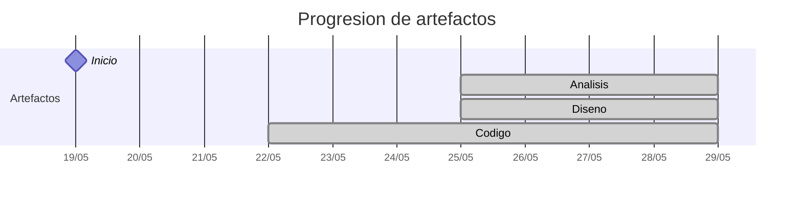

# Timeline - jerdier

> Repo: [jerdier/25-26-idsw2-sdVC](https://github.com/jerdier/25-26-idsw2-sdVC)
> Commits: 18 | Días activos: 6 | Sesiones log: 6

## Patrón observado

| Métrica | Valor |
|---|---|
| Commits propios | 18 (8 feat / 3 fix / 7 other) |
| Ratio fix/feat | 0.37 |
| Días activos | 6 |
| Sesiones documentadas | 6 |
| Sesiones sin fecha en log | 6 |

## Trazabilidad por caso de uso

| Caso de uso | D8 |
|---|:---:|
| `Administrador` | A |
| `Alumno` | A |
| `DirectorDeGrado` | A |
| `Profesor` | A |
| `Secretaria` | A |

---

## Día 2 · 2026-05-20

### Commits (1: 1 feat / 0 fix)

| Hora | Mensaje |
|---|---|
| 21:48 | [feat: QUE_HACE.md](https://github.com/jerdier/25-26-idsw2-sdVC/commit/8bbeba4cc0fc6bb3f55304137660d7a8dd340a23) |

> ⚠️ Commits sin entrada en log

---

## Día 4 · 2026-05-22

### Commits (4: 3 feat / 0 fix)

| Hora | Mensaje |
|---|---|
| 17:54 | [Merge branch 'main' of https://github.com/jerdier/25-26-idsw2-sdVC](https://github.com/jerdier/25-26-idsw2-sdVC/commit/252e1e0664ecf7039e419b0ff0573c7ce7ccad48) |
| 17:51 | [feat: SetUp Backend y Frontend Vue](https://github.com/jerdier/25-26-idsw2-sdVC/commit/d7d6705964bd55ca9584a27b3fca30e6a5f1ce9f) |
| 17:37 | [feat: Conversación segunda sesión Set up project](https://github.com/jerdier/25-26-idsw2-sdVC/commit/31b8b735e343428eee94610729f75869286e0635) |
| 17:12 | [feat: Conversación primera sesión RoadMap](https://github.com/jerdier/25-26-idsw2-sdVC/commit/d6f4c11d2d8e03ca556d214230402004cd30bd48) |

**Artefactos nuevos:** 🔌 

> ⚠️ Commits sin entrada en log

---

## Día 6 · 2026-05-24

### Commits (3: 3 feat / 0 fix)

| Hora | Mensaje |
|---|---|
| 15:54 | [feat: Conversación tercera sesión BD prisma](https://github.com/jerdier/25-26-idsw2-sdVC/commit/06b3eb4abdf5265b2208f3607aa176d1dca34348) |
| 15:52 | [feat: DiagramaClases utilizado para la BD](https://github.com/jerdier/25-26-idsw2-sdVC/commit/2fc071a95f0487daddd627e6cbe2cd69eedb2585) |
| 15:50 | [feat: DiagramaClases utilizado para la BD](https://github.com/jerdier/25-26-idsw2-sdVC/commit/e47c8bd190cc4b4e2b08285b0f5be59ec5067b6f) |

> ⚠️ Commits sin entrada en log

---

## Día 7 · 2026-05-25

### Commits (7: 1 feat / 3 fix)

| Hora | Mensaje |
|---|---|
| 00:33 | [fix: conversation_log](https://github.com/jerdier/25-26-idsw2-sdVC/commit/7bb61c15b510f8af9fc8bf3d9c636371d159359c) |
| 00:29 | [fix: images](https://github.com/jerdier/25-26-idsw2-sdVC/commit/fd92bbfe7b633c0b856aa46ecb932402df2bc0fc) |
| 00:20 | [style: actualizar imágenes a formato SVG y renombrar diagrama de clases](https://github.com/jerdier/25-26-idsw2-sdVC/commit/6a731ba7df6e2d9d7acfe61e4994176ff730fd0f) |
| 22:05 | [fix: hora inicio sesion](https://github.com/jerdier/25-26-idsw2-sdVC/commit/faf955ece959361af23cb62af23a543ca29d43d5) |
| 21:59 | [feat: esqueleto backend express y actualización RUP](https://github.com/jerdier/25-26-idsw2-sdVC/commit/891c0fcc597a03eb81e6c688c656970b6f94ce14) |
| 21:54 | [docs: estructurar RUP, descargar diagramas y diseñar API (Fase 3)](https://github.com/jerdier/25-26-idsw2-sdVC/commit/f3b69ae96fd50b15a45fa080b8fa7c1a5ede2232) |
| 20:44 | [docs: iniciar fase de análisis basada en enmabry/25-26-IdSw1-SdR y referencia pySigHor](https://github.com/jerdier/25-26-idsw2-sdVC/commit/f28530c97cab18b5e7f485ef696b9b8782e53701) |

**Artefactos nuevos:** 🔍 🧩 

> ⚠️ Commits sin entrada en log

---

## Día 8 · 2026-05-26

### Commits (2: 0 feat / 0 fix)

| Hora | Mensaje |
|---|---|
| 22:26 | [docs: finalización de la fase de análisis MVC](https://github.com/jerdier/25-26-idsw2-sdVC/commit/f7144e14b6b83d4b03c5277408b50390891d1a92) |
| 22:19 | [docs: reorganización de activos UML y consolidación de la fase de](https://github.com/jerdier/25-26-idsw2-sdVC/commit/a286408836ec251d16c7470240ef706b208ea1c9) |

> ⚠️ Commits sin entrada en log

---

## Día 9 · 2026-05-27

### Commits (1: 0 feat / 0 fix)

| Hora | Mensaje |
|---|---|
| 22:45 | [design: especificación de contratos de API REST y estructuración de la](https://github.com/jerdier/25-26-idsw2-sdVC/commit/c1ae9fd485ec6ebff15d9c9d0a9b7d82b7c79f74) |

> ⚠️ Commits sin entrada en log

---

