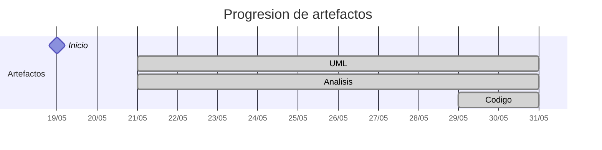

# Timeline - liamanderson873

> Repo: [liamanderson873/25-26-idsw2-sdVC](https://github.com/liamanderson873/25-26-idsw2-sdVC)
> Commits: 61 | Días activos: 6 | Sesiones log: 0

## Patrón observado

| Métrica | Valor |
|---|---|
| Commits propios | 61 (15 feat / 6 fix / 40 other) |
| Ratio fix/feat | 0.40 |
| Días activos | 6 |
| Sesiones documentadas | 0 |

<!-- trazabilidad: manual -->
## Trazabilidad por caso de uso

| Caso de uso | D3 | D6 | D7 | D11 | D12 |
|---|:---:|:---:|:---:|:---:|:---:|
| `CU-01` | A |   | D |   |   |
| `CU-02` | A |   | D |   | d |
| `CU-03` |   | A | D |   | d |
| `CU-04` |   | A | D |   | d |
| `CU-05` |   | A |   |   |   |
| `CU-06` |   | A |   |   | d |
| `CU-07` |   | A |   |   |   |
| `CU-08` |   | A |   |   |   |
| `CU-09` |   | A |   | d |   |
| `CU-10` |   | A |   |   |   |
| `CU-11` |   | A |   |   |   |
| `CU-12` |   | A |   |   |   |
| `CU-13` |   | A |   |   |   |
| `CU-14` |   | A |   |   |   |
| `CU-15` |   | A |   |   |   |
| `CU-16` |   | A |   |   |   |
| `CU-17` |   | A |   |   |   |
| `CU-18` |   | A |   |   |   |
| `CU-19` |   | A |   |   |   |
| `CU-20` |   | A |   |   |   |
| `CU-21` |   | A |   |   |   |
| `CU-22` |   | A |   |   |   |
| `CU-23` |   | A |   |   |   |
| `CU-24` |   | A |   |   |   |
| `CU-25` |   | A |   |   |   |
| `CU-26` |   | A |   |   |   |
| `CU-27` |   | A |   |   |   |
| `CU-28` |   | A |   |   |   |
| `CU-29` |   | A |   |   |   |
| `CU-30` |   | A |   |   |   |
| `CU-31` |   | A |   |   |   |
| `CU-32` |   | A |   |   |   |
| `CU-33` |   | A |   |   |   |
| `CU-34` |   | A |   |   |   |
| `CU-35` |   | A |   |   |   |
| `CU-36` |   | A |   |   |   |
| `CU-37` |   | A |   |   |   |
| `CU-38` |   | A |   |   |   |
| `CU-39` |   | A |   |   |   |
| `CU-40` |   | A |   |   |   |
| `CU-41` |   | A |   |   |   |

---

## Día 3 · 2026-05-21

### Commits (6: 2 feat / 0 fix)

| Hora | Mensaje |
|---|---|
| 13:27 | [Merge pull request #2 from liamanderson873/feat/analisis-puro-cu02](https://github.com/liamanderson873/25-26-idsw2-sdVC/commit/0df8997d8d18ee8ae2524be9b0b20578032f60df) |
| 13:23 | [Merge pull request #1 from liamanderson873/feat/analisis-puro-cu01](https://github.com/liamanderson873/25-26-idsw2-sdVC/commit/51b87b6685edc9d7e4691870f84973880dada6c2) |
| 11:26 | [docs(log): cierre de sesion con resumen de flujo de trabajo](https://github.com/liamanderson873/25-26-idsw2-sdVC/commit/e6c1c834c1705a3b27d0d5d397e92c6e513ff16f) |
| 11:20 | [feat(analisis): completar analisis puro de CU-02 y actualizar log](https://github.com/liamanderson873/25-26-idsw2-sdVC/commit/3e934857e748e711e324ad15e570936e2575af54) |
| 11:16 | [docs(log): actualizar registro de la sesion de analisis inicial](https://github.com/liamanderson873/25-26-idsw2-sdVC/commit/0014e7dfcf794042e7e5dd824375b9692438b9ac) |
| 11:07 | [feat(analisis): inicializar estructura RUP y analisis puro de CU-01](https://github.com/liamanderson873/25-26-idsw2-sdVC/commit/e7fa4a716e1933f46fa66db73f9d8338f9ecb7d4) |

**Artefactos nuevos:** 📐 🔍 

> ⚠️ Commits sin entrada en log

---

## Día 6 · 2026-05-24

### Commits (12: 4 feat / 1 fix)

| Hora | Mensaje |
|---|---|
| 18:47 | [Merge pull request #3 from liamanderson873/feat/analisis-puro-bloque-2](https://github.com/liamanderson873/25-26-idsw2-sdVC/commit/ffe1b99bae8d6da51b3ba7a6ba73d5fd8a9e24cf) |
| 18:46 | [Merge pull request #4 from liamanderson873/feat/analisis-puro-bloque-3](https://github.com/liamanderson873/25-26-idsw2-sdVC/commit/1f6b59ce5921ff571a11c67db9f8514fbed0235c) |
| 18:29 | [fix(analisis): habilitar visualizacion de diagramas PlantUML en GitHub](https://github.com/liamanderson873/25-26-idsw2-sdVC/commit/4427234c7b7262cd88da5bc8be843e2b416b0c10) |
| 18:21 | [docs(log): cierre oficial de la fase de analisis puro](https://github.com/liamanderson873/25-26-idsw2-sdVC/commit/fe8e2e69037f8b6d09238e36e7a95501fabb5991) |
| 17:59 | [refactor(analisis): reestructurar RUP/01-analisis segun estandar pySigHor](https://github.com/liamanderson873/25-26-idsw2-sdVC/commit/89c775c328fe513d9dbf27badf68d0760d264050) |
| 16:55 | [feat(analisis): completar bloque 5 final (CU-31 a CU-41)](https://github.com/liamanderson873/25-26-idsw2-sdVC/commit/76550b60c4d5a4a0da7b6dd583995a9d893f5ad2) |
| 16:51 | [Merge remote-tracking branch 'origin/main' into develop](https://github.com/liamanderson873/25-26-idsw2-sdVC/commit/13e8184598079458587ec7f65389a9a7c69b38ee) |
| 16:48 | [feat(analisis): completar bloque 4 (CU-19 a CU-30)](https://github.com/liamanderson873/25-26-idsw2-sdVC/commit/bde525b2d2cdec39989bf1144c4a2ee982cb4362) |
| 16:44 | [docs(log): actualizar log con el bloque de analisis 3](https://github.com/liamanderson873/25-26-idsw2-sdVC/commit/512d1aac8ef6d7d7eb56f6c3bcbfa3cb91f744ad) |
| 16:39 | [feat(analisis): bloque 3 - exportaciones y gestion de entidades (CU-07 a CU-18)](https://github.com/liamanderson873/25-26-idsw2-sdVC/commit/73c013fd1be2e08259848af92a2d36d2e9e13e53) |
| 16:31 | [docs(log): actualizar log con el bloque de analisis 2](https://github.com/liamanderson873/25-26-idsw2-sdVC/commit/d75bde628846e2cd93e5ed2bb6caaf4b5870a140) |
| 16:31 | [feat(analisis): analisis puro de CU-03, CU-04, CU-05 y CU-06](https://github.com/liamanderson873/25-26-idsw2-sdVC/commit/b33c06b6aea71aab8807313df141cadcdf636394) |

> ⚠️ Commits sin entrada en log

---

## Día 7 · 2026-05-25

### Commits (5: 0 feat / 0 fix)

| Hora | Mensaje |
|---|---|
| 01:58 | [docs(log): actualizar log con nuevas reglas de workflow y revision teorica](https://github.com/liamanderson873/25-26-idsw2-sdVC/commit/f54a55acb8c7fcd6f52976e97529ba9e48d9b58f) |
| 01:58 | [docs(log): actualizar log con nuevas reglas de workflow y revision teorica](https://github.com/liamanderson873/25-26-idsw2-sdVC/commit/efd3a13520120a9d8177ebd498bb5178a5dabdee) |
| 01:40 | [design(secuencia): realizacion tecnica de los 4 CUs principales](https://github.com/liamanderson873/25-26-idsw2-sdVC/commit/512a74b8696470c7f80f57c58c75ac36afdcd982) |
| 18:55 | [docs(log): refactorizacion profunda del conversation-log siguiendo el estandar exacto de pySigHor](https://github.com/liamanderson873/25-26-idsw2-sdVC/commit/9a0de939a57d6dfb095a2caa88a9357170ed4713) |
| 18:53 | [docs(log): refactorizar conversation-log segun estandar pySigHor](https://github.com/liamanderson873/25-26-idsw2-sdVC/commit/c55f0944159c1f523486e8e5f169a714239982cd) |

> ⚠️ Commits sin entrada en log

---

## Día 8 · 2026-05-26

### Commits (5: 0 feat / 0 fix)

| Hora | Mensaje |
|---|---|
| 02:11 | [docs(log): expansion exhaustiva de conversaciones y debates tecnicos ( pySigHor Style)](https://github.com/liamanderson873/25-26-idsw2-sdVC/commit/a3899aa7eb5c6fd071ba7c6c864ad874e6800746) |
| 02:08 | [docs(log): reconstruccion granular de la sesion siguiendo estandar pySigHor (Conversaciones 01-11)](https://github.com/liamanderson873/25-26-idsw2-sdVC/commit/dffd62da81476a5cdcb22c3f496b2546b70ed54a) |
| 02:04 | [docs(log): reestructuracion definitiva del log con prompts y detalles de la sesion masiva](https://github.com/liamanderson873/25-26-idsw2-sdVC/commit/f6ef8ae10edafe4eff4ac7b257f7cfefa5ddad63) |
| 02:02 | [docs(log): resolver conflicto de merge en log usando version de main](https://github.com/liamanderson873/25-26-idsw2-sdVC/commit/71a449a52dba22bfed45e72412cdb538158ca451) |
| 02:01 | [docs(log): refactorizacion exhaustiva del convesation-log con prompts y detalles tecnicos](https://github.com/liamanderson873/25-26-idsw2-sdVC/commit/90255ffe19437726f8bc79abf850e8775e82291d) |

> ⚠️ Commits sin entrada en log

---

## Día 11 · 2026-05-29

### Commits (15: 6 feat / 4 fix)

| Hora | Mensaje |
|---|---|
| 22:57 | [docs: actualizar roadmap y trazabilidad; fix: añadir estado PENDIENTE y credenciales locales de DB](https://github.com/liamanderson873/25-26-idsw2-sdVC/commit/04e6cb2b46d05befdfb1defa418291f6bfc24613) |
| 22:24 | [feat(servicio): implementar ServicioExamen con generacion de Clave de Correccion (CU-09)](https://github.com/liamanderson873/25-26-idsw2-sdVC/commit/63c2a666bdaeb4f33ce2d7256709bca9d1ca8556) |
| 22:20 | [fix(pom): corregir groupId de postgresql con caracteres invalidos](https://github.com/liamanderson873/25-26-idsw2-sdVC/commit/93c8bce86e2d8d9203534d4ffb906d01dce3a167) |
| 22:08 | [docs: sync all progress to develop branch before environment restart](https://github.com/liamanderson873/25-26-idsw2-sdVC/commit/c6b2cdbf218c8d8d659c23d541ccdbb353904678) |
| 21:54 | [feat(api): implement basic DTOs, Services and Controllers for the academic catalog](https://github.com/liamanderson873/25-26-idsw2-sdVC/commit/7ea199fe042416cce0d71f9b70ff24ab4ef36d83) |
| 21:42 | [feat(controller): implement ControladorAlumno REST endpoints](https://github.com/liamanderson873/25-26-idsw2-sdVC/commit/0ed61b04e7878cf7ea24c19b61eefe6c51f6f5ec) |
| 20:56 | [feat(service): implement ServicioAlumno with upsert logic and DTOs](https://github.com/liamanderson873/25-26-idsw2-sdVC/commit/4cfe93a993d8309db6903b022b8fdefd196a6897) |
| 20:52 | [docs(log): update conversation log with construction phase start](https://github.com/liamanderson873/25-26-idsw2-sdVC/commit/e80171015293e84a7da525544b35a7ba06e47ef5) |
| 20:50 | [feat(repo): implement remaining Spring Data JPA repositories](https://github.com/liamanderson873/25-26-idsw2-sdVC/commit/83c715cd5aa3be0ebafd7c5448719abea64935e8) |
| 20:49 | [feat(model): implement all JPA entities and enums for Jorgestor](https://github.com/liamanderson873/25-26-idsw2-sdVC/commit/90a99617eadc10d75a933d77eed76f68ea40bdee) |
| 19:02 | [fix(docs): increment cache busting version to force diagram update](https://github.com/liamanderson873/25-26-idsw2-sdVC/commit/f81a21d562b6ac0d39a72afcbc48e0b45c5a0fba) |
| 19:00 | [fix(docs): force diagram refresh with cache busting parameter](https://github.com/liamanderson873/25-26-idsw2-sdVC/commit/a1f24102ce7b75052cbdde323d23d28263d96913) |
| 18:58 | [docs(design): translate DER and DCD to Spanish for consistency](https://github.com/liamanderson873/25-26-idsw2-sdVC/commit/3b48f893b9b5e901122f74538cb469cf9ecc5952) |
| 18:57 | [fix(docs): update diagram proxy URLs to point to develop branch](https://github.com/liamanderson873/25-26-idsw2-sdVC/commit/a552a0ceffc632b4f23f38f3883ab806988d8c6d) |
| 18:56 | [docs(design): finalize DER and DCD for Jorgestor phase](https://github.com/liamanderson873/25-26-idsw2-sdVC/commit/9834d3fee52ed85cb9ab61f344820c6c7c059d8c) |

**Artefactos nuevos:** 🔌 

> ⚠️ Commits sin entrada en log

---

## Día 12 · 2026-05-30

### Commits (18: 3 feat / 1 fix)

| Hora | Mensaje |
|---|---|
| 23:14 | [docs: cierre de sesion y sincronizacion final en main](https://github.com/liamanderson873/25-26-idsw2-sdVC/commit/95744690d530985a46ced608d100c8e1fd37f9f2) |
| 23:12 | [Merge pull request #8 from liamanderson873/develop](https://github.com/liamanderson873/25-26-idsw2-sdVC/commit/2e49207f9b919799d5730eb0439da3e4bfae47af) |
| 23:08 | [chore: eliminar scripts de prueba y limpiar src/test](https://github.com/liamanderson873/25-26-idsw2-sdVC/commit/de6de07767dcc46213d2bbd626b8a9410fdeea9f) |
| 23:02 | [feat(servicio): completar exportacion de examen (CU-04) con carga eager; docs: cerrar epica I/O en log y roadmap](https://github.com/liamanderson873/25-26-idsw2-sdVC/commit/dcc79560f8a50f6c136ea26683ff74a2d1a0ee18) |
| 22:57 | [feat(servicio): implementar exportacion de examen (CU-04); docs: cerrar epica de Entradas/Salidas en log y roadmap](https://github.com/liamanderson873/25-26-idsw2-sdVC/commit/0e0f86162a46f706e5034c400eb8c8787c8ca1f2) |
| 22:46 | [fix(servicio): asegurar persistencia manual de preguntas y respuestas; docs: completar log de CU-06](https://github.com/liamanderson873/25-26-idsw2-sdVC/commit/b500fbe1a77f781d46e2d853c42fc6416899e7c8) |
| 22:11 | [docs: registrar validacion exitosa de CU-06 y actualizar roadmap](https://github.com/liamanderson873/25-26-idsw2-sdVC/commit/b347dfbd1253d299c7fea3edcf789d7fe0a4dfdc) |
| 20:59 | [docs: registrar validacion exitosa de importacion (CU-03) en postman](https://github.com/liamanderson873/25-26-idsw2-sdVC/commit/d52dd5aed6c6f42dc332ed249db42fa792db552d) |
| 20:45 | [chore: cambiar puerto del servidor a 9090 para evitar conflictos locales](https://github.com/liamanderson873/25-26-idsw2-sdVC/commit/028b32a3c542d510301d766aaa61a5c8d0816c65) |
| 20:42 | [chore: ignorar archivo local de payloads para postman](https://github.com/liamanderson873/25-26-idsw2-sdVC/commit/7469afd1a9dbf94da5d14fbcfdf9e33beb6a62b4) |
| 20:37 | [docs: registrar avance del CU-03 y correccion arquitectonica](https://github.com/liamanderson873/25-26-idsw2-sdVC/commit/cc5695e22bb3aa34ff7b0ebfb072b7460db995c5) |
| 20:26 | [docs: actualizar log con nuevo estandar y plan I/O](https://github.com/liamanderson873/25-26-idsw2-sdVC/commit/27bb5fd3d7183a12bf8dfe8dd579d54d47c049b0) |
| 20:23 | [docs: actualizar roadmap y log con validacion empirica de CU-09](https://github.com/liamanderson873/25-26-idsw2-sdVC/commit/2973051d31cb7559acff063176b3c376ff4a70a1) |
| 20:13 | [Merge pull request #7 from liamanderson873/develop](https://github.com/liamanderson873/25-26-idsw2-sdVC/commit/99a8c82ee8ed898ba348d7e284b67b58b99d3d88) |
| 19:59 | [docs: actualizar log post-validacion CU-02 y preparar BD para CU-09](https://github.com/liamanderson873/25-26-idsw2-sdVC/commit/e07762dcef75f3119192ceae5c51259c06e2d00c) |
| 19:40 | [docs: actualizar log y roadmap tras validacion exitosa de CU-02](https://github.com/liamanderson873/25-26-idsw2-sdVC/commit/9828fbfa7d3d09cf5097faa19594a77f2c5d58da) |
| 17:30 | [feat(servicio): implementar algoritmo de generacion estratificada (CU-02)](https://github.com/liamanderson873/25-26-idsw2-sdVC/commit/21c6affd5f907ccba787579501e49c78d3327126) |
| 17:20 | [Merge pull request #6 from liamanderson873/develop](https://github.com/liamanderson873/25-26-idsw2-sdVC/commit/6213507efe1ff8b7a89e6b26f5c3e1f7d4c5ffb0) |

> ⚠️ Commits sin entrada en log

---

