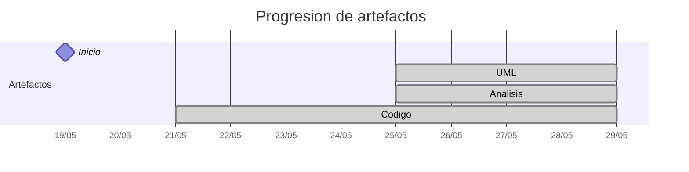

# Timeline - marcosgutierrez6

> Repo: [marcosgutierrez6/25-26-idsw2-sdVC](https://github.com/marcosgutierrez6/25-26-idsw2-sdVC)
> Commits: 19 | Días activos: 5 | Sesiones log: 18

## Patrón observado

| Métrica | Valor |
|---|---|
| Commits propios | 19 (19 feat / 0 fix / 0 other) |
| Días activos | 5 |
| Sesiones documentadas | 18 |
| Sesiones sin fecha en log | 18 |

## Trazabilidad por caso de uso

| Caso de uso | D7 | D8 | D11 |
|---|:---:|:---:|:---:|
| `corregirExamenes` | A |   |   |
| `exportarConfiguracionGlobal` | A |   |   |
| `generarExamenes` | A |   |   |
| `importarConfiguracionGlobal` | A |   |   |
| `exportarAlumnos` |   | A |   |
| `importarAlumnos` |   | A |   |
| `importarPreguntas` |   | A |   |
| `asignarExamenes` |   |   | A |
| `crearAlumno` |   |   | A |
| `crearDocente` |   |   | A |
| `crearPregunta` |   |   | A |
| `editarAsignatura` |   |   | A |
| `editarPregunta` |   |   | A |
| `exportarPreguntas` |   |   | A |

---

## Día 2 · 2026-05-20

### Commits (1: 1 feat / 0 fix)

| Hora | Mensaje |
|---|---|
| 17:35 | [feat: QUE_HACE.md commit inicial](https://github.com/marcosgutierrez6/25-26-idsw2-sdVC/commit/675e5cfe4472f178904237b6b1664ebdffc5c54a) |

> ⚠️ Commits sin entrada en log

---

## Día 3 · 2026-05-21

### Commits (2: 2 feat / 0 fix)

| Hora | Mensaje |
|---|---|
| 16:35 | [feat: Setup y ajustes del turbo repo para comenzar con el codigo](https://github.com/marcosgutierrez6/25-26-idsw2-sdVC/commit/62f9e58a591162f33778ac28fa553c367f7be79d) |
| 15:58 | [feat: Setup inicial de proyecto (contexto, reglas etc.)](https://github.com/marcosgutierrez6/25-26-idsw2-sdVC/commit/e9370574e1997febcd84ab71b5c1b0992b2cd5c7) |

**Artefactos nuevos:** 🔌 

> ⚠️ Commits sin entrada en log

---

## Día 7 · 2026-05-25

### Commits (5: 5 feat / 0 fix)

| Hora | Mensaje |
|---|---|
| 21:55 | [feat: Analisis del caso de uso de exportarrConfiguracionGlobal()](https://github.com/marcosgutierrez6/25-26-idsw2-sdVC/commit/f9c38c8477bec571c9790a2d66caeee98791c46a) |
| 21:44 | [feat: Analisis del caso de uso de importarConfiguracionGlobal()](https://github.com/marcosgutierrez6/25-26-idsw2-sdVC/commit/f6f91b556f18d281fa1fa82051992e5fb82bfc81) |
| 19:41 | [feat: Analisis del caso de uso de generarExamenes()](https://github.com/marcosgutierrez6/25-26-idsw2-sdVC/commit/5e756b27204d3e2836e9a373ca8703f13a2e8b49) |
| 19:33 | [feat: Analisis del caso de uso de corregirExamenes](https://github.com/marcosgutierrez6/25-26-idsw2-sdVC/commit/b7e2e1c38b0708ea17d03991994669cb60c6863c) |
| 19:17 | [feat: Estandarización para el analisis](https://github.com/marcosgutierrez6/25-26-idsw2-sdVC/commit/b0eaef59905b50aab21195a492d15c37290a03bf) |

**Artefactos nuevos:** 📐 🔍 

> ⚠️ Commits sin entrada en log

---

## Día 8 · 2026-05-26

### Commits (4: 4 feat / 0 fix)

| Hora | Mensaje |
|---|---|
| 10:32 | [feat: Analisis del caso de uso de exportarAlumnos()](https://github.com/marcosgutierrez6/25-26-idsw2-sdVC/commit/e3ab1488f024674f0fd83e7706bd4a9477cad8fc) |
| 10:21 | [feat: Analisis del caso de uso de importarPreguntas()](https://github.com/marcosgutierrez6/25-26-idsw2-sdVC/commit/189ad2615a4fc1d5cb5fade6e98e032e3ca7a20c) |
| 10:16 | [feat: Analisis del caso de uso de importarAlumnos()](https://github.com/marcosgutierrez6/25-26-idsw2-sdVC/commit/f2000603ab841d09c8d09f8581a7ce89dc97dd64) |
| 10:06 | [feat: Comando y regla para cleanCode](https://github.com/marcosgutierrez6/25-26-idsw2-sdVC/commit/95cc2428dac78446ac5d06da317f7cdd14729dff) |

> ⚠️ Commits sin entrada en log

---

## Día 11 · 2026-05-29

### Commits (7: 7 feat / 0 fix)

| Hora | Mensaje |
|---|---|
| 16:05 | [feat: Analisis del caso de uso de crearAlumno()](https://github.com/marcosgutierrez6/25-26-idsw2-sdVC/commit/f6b63a0bc5772f5aafb8da9bd6c635a863808cdb) |
| 16:00 | [feat: Analisis del caso de uso de crearDocente()](https://github.com/marcosgutierrez6/25-26-idsw2-sdVC/commit/9372775dd62895ce3af67c282a005e8ffca3e653) |
| 15:56 | [feat: Analisis del caso de uso de editarAsignatura()](https://github.com/marcosgutierrez6/25-26-idsw2-sdVC/commit/79d45f49c1bdd9dc4ca987e65b6eba2cee070d57) |
| 15:48 | [feat: Analisis del caso de uso de editarPregunta()](https://github.com/marcosgutierrez6/25-26-idsw2-sdVC/commit/c1c22c84ea60242e5980de021c7cec530b86d8b3) |
| 15:43 | [feat: Analisis del caso de uso de crearPregunta()](https://github.com/marcosgutierrez6/25-26-idsw2-sdVC/commit/37054c92787593b3115fb49af56a3f3323b87d7b) |
| 15:38 | [feat: Analisis del caso de uso de asignarExamenes()](https://github.com/marcosgutierrez6/25-26-idsw2-sdVC/commit/ce80aafeb89c418e99fd6146144146304c15c0fc) |
| 15:32 | [feat: Analisis del caso de uso de exportarPreguntas()](https://github.com/marcosgutierrez6/25-26-idsw2-sdVC/commit/fb6222fa3a19f63718d4608eb6b9cfc3c40fc112) |

> ⚠️ Commits sin entrada en log

---

