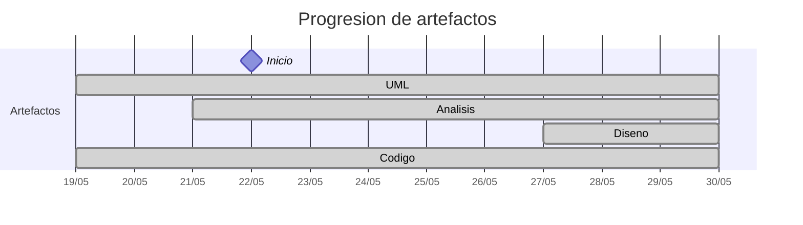

# Timeline - martinlopez7

> Repo: [martinlopez7/25-26-idsw2-sdVC](https://github.com/martinlopez7/25-26-idsw2-sdVC)
> Commits: 99 | Días activos: 9 | Sesiones log: 53

## Patrón observado

| Métrica | Valor |
|---|---|
| Commits propios | 99 (48 feat / 33 fix / 18 other) |
| Ratio fix/feat | 0.68 |
| Días activos | 9 |
| Sesiones documentadas | 53 |
| Días log+commits | 9 |
| Días solo log | 2 |
| Días solo commits | 0 |

## Trazabilidad por caso de uso

| Caso de uso | D0 | D1 | D2 | D3 | D4 | D5 | D6 | D7 |
|---|:---:|:---:|:---:|:---:|:---:|:---:|:---:|:---:|
| `verAsignaturas` | A |   |   |   |   |   |   |   |
| `verGrados` | A |   |   |   |   |   |   |   |
| `cerrarSesion` |   | A |   |   |   |   | D |   |
| `iniciarSesion` |   | A |   |   |   |   | D |   |
| `verAlumnos` |   | A |   |   |   |   |   | D |
| `completarGestion` |   |   | A |   |   |   |   | D |
| `verDocentes` |   |   | A |   |   |   | D |   |
| `verPreguntas` |   |   | A |   |   |   |   |   |
| `verRespuestas` |   |   | A |   |   |   |   |   |
| `crearDocente` |   |   |   | A |   |   | D |   |
| `crearGrado` |   |   |   | A |   |   |   |   |
| `editarDocente` |   |   |   | A |   |   | D |   |
| `eliminarDocente` |   |   |   | A |   |   |   | D |
| `exportarConfiguracionGlobal` |   |   |   | A |   |   |   |   |
| `importarConfiguracionGlobal` |   |   |   | A |   |   |   |   |
| `crearAlumno` |   |   |   |   | A |   |   | D |
| `crearAsignatura` |   |   |   |   | A |   |   |   |
| `editarAlumno` |   |   |   |   | A |   |   | D |
| `editarGrado` |   |   |   |   | A |   |   |   |
| `eliminarAlumno` |   |   |   |   | A |   |   | D |
| `eliminarGrado` |   |   |   |   | A |   |   |   |
| `crearPregunta` |   |   |   |   |   | A |   |   |
| `crearRespuesta` |   |   |   |   |   | A |   |   |
| `editarAsignatura` |   |   |   |   |   | A |   |   |
| `editarPregunta` |   |   |   |   |   | A |   |   |
| `editarRespuesta` |   |   |   |   |   | A |   |   |
| `eliminarAsignatura` |   |   |   |   |   | A |   |   |
| `eliminarPregunta` |   |   |   |   |   | A |   |   |
| `eliminarRespuesta` |   |   |   |   |   | A |   |   |
| `generarExamenes` |   |   |   |   |   | A |   |   |
| `asignarExamenes` |   |   |   |   |   |   | A |   |
| `cancelarGeneracion` |   |   |   |   |   |   | A |   |
| `corregirExamenes` |   |   |   |   |   |   | A |   |

---

## Día -1 · 2026-05-20

### 💬 Conversation-log (1 sesión)

- Crear archivo AGENTS.md con protocolo de inicialización

> ⚠️ Log sin commits

---

## Día 0 · 2026-05-21

### 💬 Conversation-log (2 sesiónes)

- Revisión de interiorización de la naturaleza del sistema y análisis de verGrados()
- Análisis de verAsignaturas()

**Artefactos nuevos:** 🔍 

> ⚠️ Log sin commits

---

## Día 1 · 2026-05-22

### Commits (5: 2 feat / 3 fix)

| Hora | Mensaje |
|---|---|
| 20:46 | [fix: redaccion de protocolo de analisis mejorada](https://github.com/martinlopez7/25-26-idsw2-sdVC/commit/cf9ead135818ff298fb60d9a2ff5ae2b70e1f878) |
| 11:58 | [fix: corrección del analisis de verAlumnos](https://github.com/martinlopez7/25-26-idsw2-sdVC/commit/f9f074cd978d2f2d5dd8808f5748062c1b7c0f94) |
| 11:51 | [feat: análisis de verAlumnos](https://github.com/martinlopez7/25-26-idsw2-sdVC/commit/dcc4d9c1282fd586947a806492a562cfba264689) |
| 11:35 | [fix: correccion del analisis de cerrarSesion](https://github.com/martinlopez7/25-26-idsw2-sdVC/commit/0a52c92cd5c114c34a9d3845d8f3c948f39c1317) |
| 11:11 | [feat: analisis de cerrarSesion](https://github.com/martinlopez7/25-26-idsw2-sdVC/commit/6edb8fdd62833e2662a543baae6185c2dd53c11a) |

### 💬 Conversation-log (3 sesiónes)

- Análisis de iniciarSesion()
- Análisis de cerrarSesion()
- Análisis de verAlumnos()

> 💬 + commits = proceso documentado

---

## Día 2 · 2026-05-23

### Commits (8: 4 feat / 4 fix)

| Hora | Mensaje |
|---|---|
| 11:59 | [fix: corrección análisis completarGestion](https://github.com/martinlopez7/25-26-idsw2-sdVC/commit/80d6785fbf4924d1a490fa9550002d9438520326) |
| 11:18 | [feat: análisis de completarGestion](https://github.com/martinlopez7/25-26-idsw2-sdVC/commit/94363547b74c294b791b753a41943cb269936f20) |
| 10:59 | [fix: corrección menot del análisis de verRespuestas](https://github.com/martinlopez7/25-26-idsw2-sdVC/commit/fa17416dc515c3f34d438bcee6a140bc7f7801e0) |
| 10:52 | [feat: análisis de verRespuestas](https://github.com/martinlopez7/25-26-idsw2-sdVC/commit/a52744db1a37e83b6da7c59ab935e1cdca5194a3) |
| 10:40 | [fix: corrección menor del análisis de verPreguntas](https://github.com/martinlopez7/25-26-idsw2-sdVC/commit/e21facef83f63de46f68f63bf7b73e2840216ef9) |
| 10:28 | [feat: análisis de verPreguntas](https://github.com/martinlopez7/25-26-idsw2-sdVC/commit/53621a9f5ed16502d509776a53a05ff5cef225de) |
| 10:14 | [fix: pequeña correccion del analisis de verDocentes](https://github.com/martinlopez7/25-26-idsw2-sdVC/commit/0b49e3bf4043eb59bfcdf12cf033a37e9fd2fca0) |
| 10:10 | [feat: análisis de verDocentes](https://github.com/martinlopez7/25-26-idsw2-sdVC/commit/15b351a2e89b95265593a88bbaba64cd551cf362) |

### 💬 Conversation-log (4 sesiónes)

- Análisis de verDocentes()
- Análisis de verPreguntas()
- Análisis de verRespuestas()
- Análisis de completarGestion()

> 💬 + commits = proceso documentado

---

## Día 3 · 2026-05-24

### Commits (12: 6 feat / 4 fix)

| Hora | Mensaje |
|---|---|
| 13:51 | [fix: correccion análisis crearGrado](https://github.com/martinlopez7/25-26-idsw2-sdVC/commit/cde6adb32263dd88f631f14bc70591ff92fe4126) |
| 13:21 | [feat: análisis de crearGrado](https://github.com/martinlopez7/25-26-idsw2-sdVC/commit/a04073bb989aebaabbbc7d07feec0832ee3f6001) |
| 13:04 | [fix: correccion analisis importarConfiguracionGlobal](https://github.com/martinlopez7/25-26-idsw2-sdVC/commit/cfdb403e33fa301c728343363a1d6b4ea07a78d6) |
| 12:59 | [feat: analisis de importarConfiguracionGlobal](https://github.com/martinlopez7/25-26-idsw2-sdVC/commit/a848c6402ad0ce73cd8b971aec72aba1a20f6562) |
| 12:45 | [fix: corrección del analisis de exportarConfiguracionGlobal](https://github.com/martinlopez7/25-26-idsw2-sdVC/commit/7602367054170785f594cd650dc1f914537d421b) |
| 12:43 | [feat: analisis de exportarConfiguracionGlobal](https://github.com/martinlopez7/25-26-idsw2-sdVC/commit/3674cde0c1f142829e6bd8c34eccedf8bba6abe1) |
| 11:40 | [docs: aceptación completa de eliminarDocente](https://github.com/martinlopez7/25-26-idsw2-sdVC/commit/1891d03ae502ce7551f15fd47a891c9124eaacf3) |
| 11:35 | [feat: análisis de eliminarDocente](https://github.com/martinlopez7/25-26-idsw2-sdVC/commit/fed59572b0e2bd34397adb10653e0f50cef6dcde) |
| 11:26 | [fix: corrección análisis editarDocente](https://github.com/martinlopez7/25-26-idsw2-sdVC/commit/139a6a7e1c77f0f4d229de4a36946faf134eb47f) |
| 11:09 | [feat: analisis de editarDocente](https://github.com/martinlopez7/25-26-idsw2-sdVC/commit/3bdd0fa3b1561d55bd4afe29e383d0d8558c2f4b) |
| 11:00 | [docs: aceptación completa de crearDocente](https://github.com/martinlopez7/25-26-idsw2-sdVC/commit/7893c1b919de21b229a5b79bdf5a9b101fc39d4a) |
| 10:58 | [feat: análisis de crearDocente](https://github.com/martinlopez7/25-26-idsw2-sdVC/commit/9d69203247722d7007acd71a3c22f24d5370d525) |

### 💬 Conversation-log (6 sesiónes)

- Análisis de crearDocente()
- Análisis de editarDocente()
- Análisis de eliminarDocente()
- Análisis de exportarConfiguracionGlobal()
- Análisis de importarConfiguracionGlobal()
- Análisis de crearGrado()

> 💬 + commits = proceso documentado

---

## Día 4 · 2026-05-25

### Commits (12: 6 feat / 2 fix)

| Hora | Mensaje |
|---|---|
| 18:05 | [fix: correccion analisis crearAsignatura](https://github.com/martinlopez7/25-26-idsw2-sdVC/commit/abb2e6b92bdbfbf66cb5f3b9670074c7bb01c3b8) |
| 12:46 | [feat: analisis de crearAsignatura](https://github.com/martinlopez7/25-26-idsw2-sdVC/commit/5c7d15a82ed1140a25411fb12384acadcb4ab507) |
| 12:38 | [docs: aceptación completa del caso de uso eliminarAlumno](https://github.com/martinlopez7/25-26-idsw2-sdVC/commit/dbeafcba64a1669df7a057f0b9ed1cb91ed10918) |
| 12:34 | [feat: análisis de eliminarAlumno](https://github.com/martinlopez7/25-26-idsw2-sdVC/commit/43ce84900452aadf6605ae8050648d35d6ca09f6) |
| 12:27 | [docs: aceptación completa del caso de uso editarAlumno](https://github.com/martinlopez7/25-26-idsw2-sdVC/commit/3bae978f773b0f6cc7c267968230396e2be8831d) |
| 12:26 | [feat: analisis de editarAlumno](https://github.com/martinlopez7/25-26-idsw2-sdVC/commit/760225a96042d9637cb19227760a99df9c6af8a4) |
| 12:14 | [docs: aceptación completa del caso de uso crearAlumno](https://github.com/martinlopez7/25-26-idsw2-sdVC/commit/355067a91c5ef192833891c3be3807dd2301d31d) |
| 12:13 | [feat: analisis de crearAlumno](https://github.com/martinlopez7/25-26-idsw2-sdVC/commit/fb55d6d82f1ddfb5e29bc2ac4e66fef60515f72a) |
| 12:00 | [docs: aceptación completa de eliminarGrado](https://github.com/martinlopez7/25-26-idsw2-sdVC/commit/1476756925b31f2f0f0260397d0eb8e4d5ff8030) |
| 11:56 | [feat: analisis caso de uso eliminarGrado](https://github.com/martinlopez7/25-26-idsw2-sdVC/commit/9b5a936fb7e1414a26851721392d67bcd810e512) |
| 11:45 | [fix: correccion analisis editarGrado](https://github.com/martinlopez7/25-26-idsw2-sdVC/commit/35ae4bffd7362f0667c13074aee3d5c2a810f303) |
| 11:32 | [feat: analisis de editarGrado](https://github.com/martinlopez7/25-26-idsw2-sdVC/commit/be36644707d6a44bec1363dc85a223852775697a) |

### 💬 Conversation-log (6 sesiónes)

- Análisis de editarGrado()
- Análisis de eliminarGrado()
- Análisis de crearAlumno()
- Análisis de editarAlumno()
- Análisis de eliminarAlumno()
- Análisis de crearAsignatura()

> 💬 + commits = proceso documentado

---

## Día 5 · 2026-05-26

### Commits (18: 9 feat / 7 fix)

| Hora | Mensaje |
|---|---|
| 12:57 | [fix: correccion analisis generarExamenes](https://github.com/martinlopez7/25-26-idsw2-sdVC/commit/f883774bf7cf4c7ad6f9ecfb754494e79cc5c33c) |
| 12:52 | [feat: analisis de generarExamenes](https://github.com/martinlopez7/25-26-idsw2-sdVC/commit/d6acef3f5c86cd9697f4edcc00e04a2ff792dcc7) |
| 12:02 | [fix: correccion analisis eliminarRespuesta](https://github.com/martinlopez7/25-26-idsw2-sdVC/commit/bb6676467826a833fd88f732ab86668eaed2b85f) |
| 11:56 | [feat: analisis de eliminarRespuesta](https://github.com/martinlopez7/25-26-idsw2-sdVC/commit/daff3b2cb8666c2c5e9ef495ccd12a24e27cfb3e) |
| 11:31 | [fix: correccion analisis editarRespuesta](https://github.com/martinlopez7/25-26-idsw2-sdVC/commit/a94aaebcccd426af7ea9482e0988466cd62ed2c8) |
| 11:20 | [feat: analisis de editarRespuesta](https://github.com/martinlopez7/25-26-idsw2-sdVC/commit/8419c1057be40a040a9503126054281c41a3f63c) |
| 11:10 | [docs: aceptación completa del caso de uso crearRespuesta](https://github.com/martinlopez7/25-26-idsw2-sdVC/commit/aa6411a3a576d309765f488abf3a116159e12918) |
| 11:08 | [feat: analisis de crearRespuesta](https://github.com/martinlopez7/25-26-idsw2-sdVC/commit/3d674c959c5c997a757357a19e80abef59fc3de2) |
| 10:52 | [fix: correccion analisis eliminarPregunta](https://github.com/martinlopez7/25-26-idsw2-sdVC/commit/e2363e2cee4d6bf08a3a0b8555dd534c713b51a4) |
| 10:45 | [feat: analisis de eliminarPregunta](https://github.com/martinlopez7/25-26-idsw2-sdVC/commit/db0a1771201506bf63e6f8fb5435fbdcaa7b3db3) |
| 10:35 | [fix: correccion analisis editarAsignatura](https://github.com/martinlopez7/25-26-idsw2-sdVC/commit/199f05f70aa77ca92828c1700498db1a262bf915) |
| 10:17 | [feat: analisis de editarPregunta](https://github.com/martinlopez7/25-26-idsw2-sdVC/commit/6263a283bcce44cd98dcc65b1187cadfdf29cceb) |
| 10:09 | [fix: correccion analisis crearPregunta](https://github.com/martinlopez7/25-26-idsw2-sdVC/commit/947b17c0b5ca99d7c1eb017e52d57f0b1eacad25) |
| 09:59 | [feat: analisis de crearPregunta](https://github.com/martinlopez7/25-26-idsw2-sdVC/commit/f3cfb7e6a66299ad769bd5e81c30098bb04980aa) |
| 09:52 | [docs: aceptación completa del caso de uso eliminarAsignatura](https://github.com/martinlopez7/25-26-idsw2-sdVC/commit/ba5f8b7cf3ca5a7a6a3983ea7682fbfe81296caf) |
| 09:49 | [feat: analisis de eliminarAsignatura](https://github.com/martinlopez7/25-26-idsw2-sdVC/commit/5250011c74cd7aa348e1d925fa7644655e9cc302) |
| 09:42 | [fix: correcion analisis editarAsignatura](https://github.com/martinlopez7/25-26-idsw2-sdVC/commit/e498be44e855e52049a12b993116ff6b0ef6fffa) |
| 09:19 | [feat: analisis editarAsignatura](https://github.com/martinlopez7/25-26-idsw2-sdVC/commit/e424d303ffd834718a7b63f257d81cb28831eb4a) |

### 💬 Conversation-log (9 sesiónes)

- Análisis de editarAsignatura()
- Análisis de eliminarAsignatura()
- Análisis de crearPregunta()
- Análisis de editarPregunta()
- Análisis de eliminarPregunta()
- Análisis de crearRespuesta()
- Análisis de editarRespuesta()
- Análisis de eliminarRespuesta()
- Análisis de generarExamenes()

> 💬 + commits = proceso documentado

---

## Día 6 · 2026-05-27

### Commits (17: 8 feat / 4 fix)

| Hora | Mensaje |
|---|---|
| 12:35 | [docs: aceptación diseño editarDocente](https://github.com/martinlopez7/25-26-idsw2-sdVC/commit/55c28aa4a61163da8cfb47bab2097e26b8d33c2f) |
| 12:33 | [feat: diseño de editarDocente](https://github.com/martinlopez7/25-26-idsw2-sdVC/commit/b75e94f76e1d8d6524b122549e1ba1e085aa2896) |
| 12:23 | [docs: aceptación del diseño de verDocentes](https://github.com/martinlopez7/25-26-idsw2-sdVC/commit/1411413287337e8a7adfe7abaca7e30d03dc2162) |
| 12:21 | [feat: diseño de verDocentes](https://github.com/martinlopez7/25-26-idsw2-sdVC/commit/a2ece9b0b68d374289c7b2c5049e29d96a64ecfe) |
| 12:09 | [fix: correcion diseño crearDocente](https://github.com/martinlopez7/25-26-idsw2-sdVC/commit/8569117e2444b78bf62be681947a774d9c43216d) |
| 12:04 | [feat: diseño de crearDocente](https://github.com/martinlopez7/25-26-idsw2-sdVC/commit/effd3cdead47d096b7c1a12a5a355c5b98739c2f) |
| 11:41 | [fix: correccion diseño cerrarSesion y adicion de la imagen del diagrama de secuencia de iniciarSesion (se me olvidó en el anterior commit)](https://github.com/martinlopez7/25-26-idsw2-sdVC/commit/9a2b9894d0ce94617b4a6e5e0a7039fc9fd130a1) |
| 11:21 | [feat: diseño de cerrarSesion](https://github.com/martinlopez7/25-26-idsw2-sdVC/commit/5bfe907c72474c1808e2241fc8953e220e424fca) |
| 11:14 | [docs: adición de la conversación del diseño de iniciarSesion y aceptación del diseño](https://github.com/martinlopez7/25-26-idsw2-sdVC/commit/6efa9e61e33b2dd871012048eee24c44c76b4f71) |
| 11:08 | [feat: diseño de iniciarSesion](https://github.com/martinlopez7/25-26-idsw2-sdVC/commit/9ff6a798bbf7b7fe8f63cd01cac2cc9f809ba4b0) |
| 10:52 | [docs: adición de protocolo de diseño](https://github.com/martinlopez7/25-26-idsw2-sdVC/commit/76f883539bb62c5e788693d0c83f2ca74013bb3e) |
| 10:22 | [docs: aceptacion completa del caso de uso corregirExamenes](https://github.com/martinlopez7/25-26-idsw2-sdVC/commit/894f2119a60ce320b6b66655e9e738a5b8960c96) |
| 10:19 | [feat: analisis de corregirExamenes](https://github.com/martinlopez7/25-26-idsw2-sdVC/commit/a9719b8054e808202569316deaa4bf90d0624401) |
| 10:08 | [fix: correccion analisis asignarExamenes](https://github.com/martinlopez7/25-26-idsw2-sdVC/commit/593af2e4c9815c39fca47c570c69fff40c2cd740) |
| 09:55 | [feat: analisis de asignarExamenes](https://github.com/martinlopez7/25-26-idsw2-sdVC/commit/efe6f9a1b9044e5c16c86eb2d2334b3e79fcbf42) |
| 09:42 | [fix: correccion analisis cancelarGeneracion](https://github.com/martinlopez7/25-26-idsw2-sdVC/commit/86131eec8e9a191d03866d06110c47d53c3ded1f) |
| 09:37 | [feat: analisis de cancelarGeneracion](https://github.com/martinlopez7/25-26-idsw2-sdVC/commit/821fbb0ec82a9b93ab995ac01cb3baecf4fcae5f) |

### 💬 Conversation-log (8 sesiónes)

- Análisis de cancelarGeneracion()
- Análisis de asignarExamenes()
- Análisis de corregirExamenes()
- Diseño de iniciarSesion()
- Diseño de cerrarSesion()
- Diseño de crearDocente()
- Diseño de verDocentes()
- Diseño de editarDocente()

**Artefactos nuevos:** 🧩 

> 💬 + commits = proceso documentado

---

## Día 7 · 2026-05-28

### Commits (15: 6 feat / 5 fix)

| Hora | Mensaje |
|---|---|
| 12:15 | [docs: aceptacion del diseño de eliminarAlumno](https://github.com/martinlopez7/25-26-idsw2-sdVC/commit/433a791745f23b6ce1422d3c96d6041d28445cdc) |
| 12:14 | [feat: diseño de eliminarAlumno](https://github.com/martinlopez7/25-26-idsw2-sdVC/commit/fb39cf8377c8200815c288c873b3bee6afb67684) |
| 11:44 | [docs: aceptación de diseño editarAlumno](https://github.com/martinlopez7/25-26-idsw2-sdVC/commit/127bbd605fe8b332f49e230a27035d12508474a3) |
| 11:43 | [feat: diseño de editarAlumno](https://github.com/martinlopez7/25-26-idsw2-sdVC/commit/52e47aa75c18798852941e446504fb15232eb352) |
| 11:19 | [docs: concrecion protocolo de diseño](https://github.com/martinlopez7/25-26-idsw2-sdVC/commit/154145bf7150303f1dfe75683dc0a7f2ee81125b) |
| 11:12 | [fix: correccion diseño crearAlumno](https://github.com/martinlopez7/25-26-idsw2-sdVC/commit/bcfae34103200133a086b77a11d9ca5795fcbd98) |
| 11:07 | [fix: concreciones de JWT de diseño de verAlumnos](https://github.com/martinlopez7/25-26-idsw2-sdVC/commit/68eaaa51895bbab9aee94795858075c986fd658a) |
| 10:55 | [feat: diseño de crearAlumno](https://github.com/martinlopez7/25-26-idsw2-sdVC/commit/667a52021316684c24f3960600c97da49a858d90) |
| 10:51 | [fix: adicion de validacion de token en el diseño de verAlumnos](https://github.com/martinlopez7/25-26-idsw2-sdVC/commit/c1494d28aaf061bb060c6d744e4cfa1cd5206bf7) |
| 10:41 | [fix: correccion diseño verAlumnos](https://github.com/martinlopez7/25-26-idsw2-sdVC/commit/ba44b52473e51790de4708aba8a2010505da3549) |
| 10:24 | [feat: diseño de verAlumnos](https://github.com/martinlopez7/25-26-idsw2-sdVC/commit/bfac79d848fe9fdc382deffd360195921c037c72) |
| 09:54 | [fix: correccion diseño completarGestion](https://github.com/martinlopez7/25-26-idsw2-sdVC/commit/61a52b7c71f896cc22fbe25e4f3f4c8f32539063) |
| 09:34 | [feat: diseño de completarGestion](https://github.com/martinlopez7/25-26-idsw2-sdVC/commit/d9802703645d67d6952746faad2da090833c9711) |
| 09:20 | [docs: pendiente correccion del diseño de eliminarDocente](https://github.com/martinlopez7/25-26-idsw2-sdVC/commit/14e115b3eca8e66001156e40772310cd8e29268e) |
| 09:12 | [feat: análisis de eliminarDocente](https://github.com/martinlopez7/25-26-idsw2-sdVC/commit/f0f82eb70d3c601ce1321a90849a37b39792f316) |

### 💬 Conversation-log (6 sesiónes)

- Diseño de eliminarDocente()
- Diseño de completarGestion()
- Diseño de verAlumnos()
- Diseño de crearAlumno()
- Diseño de editarAlumno()
- Diseño de eliminarAlumno()

> 💬 + commits = proceso documentado

---

## Día 8 · 2026-05-29

### Commits (10: 6 feat / 4 fix)

| Hora | Mensaje |
|---|---|
| 15:09 | [fix: correccion implementación caso de uso eliminarDocente](https://github.com/martinlopez7/25-26-idsw2-sdVC/commit/ec1a96389cd725b2a4717efa4a181a99a333e9c4) |
| 14:10 | [feat: implementacion caso de uso eliminarDocente](https://github.com/martinlopez7/25-26-idsw2-sdVC/commit/2c36fff0ba94d667aa4f13e3969162aa078b33f5) |
| 13:54 | [fix: correccion implementación caso de uso crearDocente para que transfiera automáticamente a editarDocente](https://github.com/martinlopez7/25-26-idsw2-sdVC/commit/5690d4e4732f1506df373661f1c61818ba4775fc) |
| 13:41 | [feat: implementacion de caso de uso editarDocente](https://github.com/martinlopez7/25-26-idsw2-sdVC/commit/aab29c589f6629b85762bc298185236589e4dc65) |
| 13:00 | [fix: correccion de caso de uso verDocentes](https://github.com/martinlopez7/25-26-idsw2-sdVC/commit/8fdc1fe2f18d2eb06bfaec8295a783dd163a3bbf) |
| 12:42 | [fix: correccion implementación de crearDocente](https://github.com/martinlopez7/25-26-idsw2-sdVC/commit/b14bc4971801a7aa00b767d477ce50d87623557f) |
| 12:37 | [feat: implementacion de caso de uso crearDocente](https://github.com/martinlopez7/25-26-idsw2-sdVC/commit/047b61d64a60751c584cb8d249bc78dca7df1f47) |
| 10:37 | [feat: implementacion del caso de uso verDocentes](https://github.com/martinlopez7/25-26-idsw2-sdVC/commit/a7389f4d12e34d92fb3669548b85e43365958af4) |
| 09:44 | [feat: implementación del caso de uso cerrarSesion](https://github.com/martinlopez7/25-26-idsw2-sdVC/commit/41a67cfab51ce9de2a99ec2c6ccaf914685635df) |
| 09:14 | [feat: inicialización de proyectos springboot y react e implementación del caso de uso iniciarSesion](https://github.com/martinlopez7/25-26-idsw2-sdVC/commit/b7c1a82f8383563a742093bb0193de4519172803) |

### 💬 Conversation-log (7 sesiónes)

- Inicialización de proyectos e implementación de iniciarSesion
- Implementación de cerrarSesion()
- Implementación de verDocentes() y menús diferenciados por actor
- Implementación de crearDocente() y corrección de JwtAuthenticationFilter
- Corrección de verDocentes() de acuerdo a su diseño
- Implementación de editarDocente()
- Implementación de eliminarDocente()

> 💬 + commits = proceso documentado

---

## Día 9 · 2026-05-30

### Commits (2: 1 feat / 0 fix)

| Hora | Mensaje |
|---|---|
| 10:17 | [docs: aceptacion de implementacion de verAlumnos](https://github.com/martinlopez7/25-26-idsw2-sdVC/commit/5cc80f5734351d7925270098a59d2cc60dd202d4) |
| 10:11 | [feat: implementacion de verAlumnos](https://github.com/martinlopez7/25-26-idsw2-sdVC/commit/440fe299bac45d338dbb9df85460af3ee1ace2d3) |

### 💬 Conversation-log (1 sesión)

- Implementación de verAlumnos()

> 💬 + commits = proceso documentado

---

