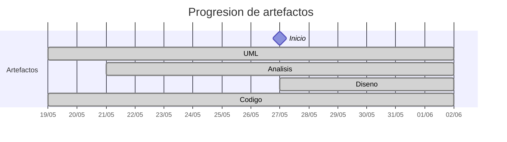

# Timeline - martinlopez7

> Repo: [martinlopez7/25-26-idsw2-sdVC](https://github.com/martinlopez7/25-26-idsw2-sdVC)
> Commits: 99 | Días activos: 7 | Sesiones log: 93

## Patrón observado

| Métrica | Valor |
|---|---|
| Commits propios | 99 (55 feat / 29 fix / 15 other) |
| Ratio fix/feat | 0.52 |
| Días activos | 7 |
| Sesiones documentadas | 93 |
| Días log+commits | 7 |
| Días solo log | 7 |
| Días solo commits | 0 |

## Trazabilidad por caso de uso

| Caso de uso | D-5 | D-4 | D-3 | D-2 | D-1 | D0 | D1 | D2 | D4 | D6 | D7 |
|---|:---:|:---:|:---:|:---:|:---:|:---:|:---:|:---:|:---:|:---:|:---:|
| `verAsignaturas` | A |   |   |   |   |   |   |   |   | D |   |
| `verGrados` | A |   |   |   |   |   |   |   | D |   |   |
| `cerrarSesion` |   | A |   |   |   |   | D |   |   |   |   |
| `iniciarSesion` |   | A |   |   |   |   | D |   |   |   |   |
| `verAlumnos` |   | A |   |   |   |   |   | D |   |   |   |
| `completarGestion` |   |   | A |   |   |   |   | D |   |   |   |
| `verDocentes` |   |   | A |   |   |   | D |   |   |   |   |
| `verPreguntas` |   |   | A |   |   |   |   |   |   |   | D |
| `verRespuestas` |   |   | A |   |   |   |   |   |   |   | D |
| `crearDocente` |   |   |   | A |   |   | D |   |   |   |   |
| `crearGrado` |   |   |   | A |   |   |   |   | D |   |   |
| `editarDocente` |   |   |   | A |   |   | D |   |   |   |   |
| `eliminarDocente` |   |   |   | A |   |   |   | D |   |   |   |
| `exportarConfiguracionGlobal` |   |   |   | A |   |   |   |   |   |   |   |
| `importarConfiguracionGlobal` |   |   |   | A |   |   |   |   |   |   |   |
| `crearAlumno` |   |   |   |   | A |   |   | D |   |   |   |
| `crearAsignatura` |   |   |   |   | A |   |   |   |   | D |   |
| `editarAlumno` |   |   |   |   | A |   |   | D |   |   |   |
| `editarGrado` |   |   |   |   | A |   |   |   | D |   |   |
| `eliminarAlumno` |   |   |   |   | A |   |   | D |   |   |   |
| `eliminarGrado` |   |   |   |   | A |   |   |   | D |   |   |
| `crearPregunta` |   |   |   |   |   | A |   |   |   |   | D |
| `crearRespuesta` |   |   |   |   |   | A |   |   |   |   | D |
| `editarAsignatura` |   |   |   |   |   | A |   |   |   | D |   |
| `editarPregunta` |   |   |   |   |   | A |   |   |   |   | D |
| `editarRespuesta` |   |   |   |   |   | A |   |   |   |   | D |
| `eliminarAsignatura` |   |   |   |   |   | A |   |   |   | D |   |
| `eliminarPregunta` |   |   |   |   |   | A |   |   |   |   | D |
| `eliminarRespuesta` |   |   |   |   |   | A |   |   |   |   | D |
| `generarExamenes` |   |   |   |   |   | A |   |   |   |   |   |
| `asignarExamenes` |   |   |   |   |   |   | A |   |   |   |   |
| `cancelarGeneracion` |   |   |   |   |   |   | A |   |   |   |   |
| `corregirExamenes` |   |   |   |   |   |   | A |   |   |   |   |

---

## Día -6 · 2026-05-20

### 💬 Conversation-log (1 sesión)

- Crear archivo AGENTS.md con protocolo de inicialización

> ⚠️ Log sin commits

---

## Día -5 · 2026-05-21

### 💬 Conversation-log (2 sesiónes)

- Revisión de interiorización de la naturaleza del sistema y análisis de verGrados()
- Análisis de verAsignaturas()

**Artefactos nuevos:** 🔍 

> ⚠️ Log sin commits

---

## Día -4 · 2026-05-22

### 💬 Conversation-log (3 sesiónes)

- Análisis de iniciarSesion()
- Análisis de cerrarSesion()
- Análisis de verAlumnos()

> ⚠️ Log sin commits

---

## Día -3 · 2026-05-23

### 💬 Conversation-log (4 sesiónes)

- Análisis de verDocentes()
- Análisis de verPreguntas()
- Análisis de verRespuestas()
- Análisis de completarGestion()

> ⚠️ Log sin commits

---

## Día -2 · 2026-05-24

### 💬 Conversation-log (6 sesiónes)

- Análisis de crearDocente()
- Análisis de editarDocente()
- Análisis de eliminarDocente()
- Análisis de exportarConfiguracionGlobal()
- Análisis de importarConfiguracionGlobal()
- Análisis de crearGrado()

> ⚠️ Log sin commits

---

## Día -1 · 2026-05-25

### 💬 Conversation-log (6 sesiónes)

- Análisis de editarGrado()
- Análisis de eliminarGrado()
- Análisis de crearAlumno()
- Análisis de editarAlumno()
- Análisis de eliminarAlumno()
- Análisis de crearAsignatura()

> ⚠️ Log sin commits

---

## Día 0 · 2026-05-26

### 💬 Conversation-log (9 sesiónes)

- Análisis de editarAsignatura()
- Análisis de eliminarAsignatura()
- Análisis de crearPregunta()
- Análisis de editarPregunta()
- Análisis de eliminarPregunta()
- Análisis de crearRespuesta()
- Análisis de editarRespuesta()
- Análisis de eliminarRespuesta()
- Análisis de generarExamenes()

> ⚠️ Log sin commits

---

## Día 1 · 2026-05-27

### Commits (15: 7 feat / 3 fix)

| Hora | Mensaje |
|---|---|
| 12:35 | [docs: aceptación diseño editarDocente](https://github.com/martinlopez7/25-26-idsw2-sdVC/commit/55c28aa4a61163da8cfb47bab2097e26b8d33c2f) |
| 12:33 | [feat: diseño de editarDocente](https://github.com/martinlopez7/25-26-idsw2-sdVC/commit/b75e94f76e1d8d6524b122549e1ba1e085aa2896) |
| 12:23 | [docs: aceptación del diseño de verDocentes](https://github.com/martinlopez7/25-26-idsw2-sdVC/commit/1411413287337e8a7adfe7abaca7e30d03dc2162) |
| 12:21 | [feat: diseño de verDocentes](https://github.com/martinlopez7/25-26-idsw2-sdVC/commit/a2ece9b0b68d374289c7b2c5049e29d96a64ecfe) |
| 12:09 | [fix: correcion diseño crearDocente](https://github.com/martinlopez7/25-26-idsw2-sdVC/commit/8569117e2444b78bf62be681947a774d9c43216d) |
| 12:04 | [feat: diseño de crearDocente](https://github.com/martinlopez7/25-26-idsw2-sdVC/commit/effd3cdead47d096b7c1a12a5a355c5b98739c2f) |
| 11:41 | [fix: correccion diseño cerrarSesion y adicion de la imagen del diagrama de secuencia de iniciarSesion (se me olvidó en el anterior commit)](https://github.com/martinlopez7/25-26-idsw2-sdVC/commit/9a2b9894d0ce94617b4a6e5e0a7039fc9fd130a1) |
| 11:21 | [feat: diseño de cerrarSesion](https://github.com/martinlopez7/25-26-idsw2-sdVC/commit/5bfe907c72474c1808e2241fc8953e220e424fca) |
| 11:14 | [docs: adición de la conversación del diseño de iniciarSesion y aceptación del diseño](https://github.com/martinlopez7/25-26-idsw2-sdVC/commit/6efa9e61e33b2dd871012048eee24c44c76b4f71) |
| 11:08 | [feat: diseño de iniciarSesion](https://github.com/martinlopez7/25-26-idsw2-sdVC/commit/9ff6a798bbf7b7fe8f63cd01cac2cc9f809ba4b0) |
| 10:52 | [docs: adición de protocolo de diseño](https://github.com/martinlopez7/25-26-idsw2-sdVC/commit/76f883539bb62c5e788693d0c83f2ca74013bb3e) |
| 10:22 | [docs: aceptacion completa del caso de uso corregirExamenes](https://github.com/martinlopez7/25-26-idsw2-sdVC/commit/894f2119a60ce320b6b66655e9e738a5b8960c96) |
| 10:19 | [feat: analisis de corregirExamenes](https://github.com/martinlopez7/25-26-idsw2-sdVC/commit/a9719b8054e808202569316deaa4bf90d0624401) |
| 10:08 | [fix: correccion analisis asignarExamenes](https://github.com/martinlopez7/25-26-idsw2-sdVC/commit/593af2e4c9815c39fca47c570c69fff40c2cd740) |
| 09:55 | [feat: analisis de asignarExamenes](https://github.com/martinlopez7/25-26-idsw2-sdVC/commit/efe6f9a1b9044e5c16c86eb2d2334b3e79fcbf42) |

### 💬 Conversation-log (8 sesiónes)

- Análisis de cancelarGeneracion()
- Análisis de asignarExamenes()
- Análisis de corregirExamenes()
- Diseño de iniciarSesion()
- Diseño de cerrarSesion()
- Diseño de crearDocente()
- Diseño de verDocentes()
- Diseño de editarDocente()

**Artefactos nuevos:** 🧩 

> 💬 + commits = proceso documentado

---

## Día 2 · 2026-05-28

### Commits (15: 6 feat / 5 fix)

| Hora | Mensaje |
|---|---|
| 12:15 | [docs: aceptacion del diseño de eliminarAlumno](https://github.com/martinlopez7/25-26-idsw2-sdVC/commit/433a791745f23b6ce1422d3c96d6041d28445cdc) |
| 12:14 | [feat: diseño de eliminarAlumno](https://github.com/martinlopez7/25-26-idsw2-sdVC/commit/fb39cf8377c8200815c288c873b3bee6afb67684) |
| 11:44 | [docs: aceptación de diseño editarAlumno](https://github.com/martinlopez7/25-26-idsw2-sdVC/commit/127bbd605fe8b332f49e230a27035d12508474a3) |
| 11:43 | [feat: diseño de editarAlumno](https://github.com/martinlopez7/25-26-idsw2-sdVC/commit/52e47aa75c18798852941e446504fb15232eb352) |
| 11:19 | [docs: concrecion protocolo de diseño](https://github.com/martinlopez7/25-26-idsw2-sdVC/commit/154145bf7150303f1dfe75683dc0a7f2ee81125b) |
| 11:12 | [fix: correccion diseño crearAlumno](https://github.com/martinlopez7/25-26-idsw2-sdVC/commit/bcfae34103200133a086b77a11d9ca5795fcbd98) |
| 11:07 | [fix: concreciones de JWT de diseño de verAlumnos](https://github.com/martinlopez7/25-26-idsw2-sdVC/commit/68eaaa51895bbab9aee94795858075c986fd658a) |
| 10:55 | [feat: diseño de crearAlumno](https://github.com/martinlopez7/25-26-idsw2-sdVC/commit/667a52021316684c24f3960600c97da49a858d90) |
| 10:51 | [fix: adicion de validacion de token en el diseño de verAlumnos](https://github.com/martinlopez7/25-26-idsw2-sdVC/commit/c1494d28aaf061bb060c6d744e4cfa1cd5206bf7) |
| 10:41 | [fix: correccion diseño verAlumnos](https://github.com/martinlopez7/25-26-idsw2-sdVC/commit/ba44b52473e51790de4708aba8a2010505da3549) |
| 10:24 | [feat: diseño de verAlumnos](https://github.com/martinlopez7/25-26-idsw2-sdVC/commit/bfac79d848fe9fdc382deffd360195921c037c72) |
| 09:54 | [fix: correccion diseño completarGestion](https://github.com/martinlopez7/25-26-idsw2-sdVC/commit/61a52b7c71f896cc22fbe25e4f3f4c8f32539063) |
| 09:34 | [feat: diseño de completarGestion](https://github.com/martinlopez7/25-26-idsw2-sdVC/commit/d9802703645d67d6952746faad2da090833c9711) |
| 09:20 | [docs: pendiente correccion del diseño de eliminarDocente](https://github.com/martinlopez7/25-26-idsw2-sdVC/commit/14e115b3eca8e66001156e40772310cd8e29268e) |
| 09:12 | [feat: análisis de eliminarDocente](https://github.com/martinlopez7/25-26-idsw2-sdVC/commit/f0f82eb70d3c601ce1321a90849a37b39792f316) |

### 💬 Conversation-log (6 sesiónes)

- Diseño de eliminarDocente()
- Diseño de completarGestion()
- Diseño de verAlumnos()
- Diseño de crearAlumno()
- Diseño de editarAlumno()
- Diseño de eliminarAlumno()

> 💬 + commits = proceso documentado

---

## Día 3 · 2026-05-29

### Commits (10: 6 feat / 4 fix)

| Hora | Mensaje |
|---|---|
| 15:09 | [fix: correccion implementación caso de uso eliminarDocente](https://github.com/martinlopez7/25-26-idsw2-sdVC/commit/ec1a96389cd725b2a4717efa4a181a99a333e9c4) |
| 14:10 | [feat: implementacion caso de uso eliminarDocente](https://github.com/martinlopez7/25-26-idsw2-sdVC/commit/2c36fff0ba94d667aa4f13e3969162aa078b33f5) |
| 13:54 | [fix: correccion implementación caso de uso crearDocente para que transfiera automáticamente a editarDocente](https://github.com/martinlopez7/25-26-idsw2-sdVC/commit/5690d4e4732f1506df373661f1c61818ba4775fc) |
| 13:41 | [feat: implementacion de caso de uso editarDocente](https://github.com/martinlopez7/25-26-idsw2-sdVC/commit/aab29c589f6629b85762bc298185236589e4dc65) |
| 13:00 | [fix: correccion de caso de uso verDocentes](https://github.com/martinlopez7/25-26-idsw2-sdVC/commit/8fdc1fe2f18d2eb06bfaec8295a783dd163a3bbf) |
| 12:42 | [fix: correccion implementación de crearDocente](https://github.com/martinlopez7/25-26-idsw2-sdVC/commit/b14bc4971801a7aa00b767d477ce50d87623557f) |
| 12:37 | [feat: implementacion de caso de uso crearDocente](https://github.com/martinlopez7/25-26-idsw2-sdVC/commit/047b61d64a60751c584cb8d249bc78dca7df1f47) |
| 10:37 | [feat: implementacion del caso de uso verDocentes](https://github.com/martinlopez7/25-26-idsw2-sdVC/commit/a7389f4d12e34d92fb3669548b85e43365958af4) |
| 09:44 | [feat: implementación del caso de uso cerrarSesion](https://github.com/martinlopez7/25-26-idsw2-sdVC/commit/41a67cfab51ce9de2a99ec2c6ccaf914685635df) |
| 09:14 | [feat: inicialización de proyectos springboot y react e implementación del caso de uso iniciarSesion](https://github.com/martinlopez7/25-26-idsw2-sdVC/commit/b7c1a82f8383563a742093bb0193de4519172803) |

### 💬 Conversation-log (7 sesiónes)

- Inicialización de proyectos e implementación de iniciarSesion
- Implementación de cerrarSesion()
- Implementación de verDocentes() y menús diferenciados por actor
- Implementación de crearDocente() y corrección de JwtAuthenticationFilter
- Corrección de verDocentes() de acuerdo a su diseño
- Implementación de editarDocente()
- Implementación de eliminarDocente()

> 💬 + commits = proceso documentado

---

## Día 4 · 2026-05-30

### Commits (12: 8 feat / 1 fix)

| Hora | Mensaje |
|---|---|
| 17:34 | [feat: diseño de eliminarGrado](https://github.com/martinlopez7/25-26-idsw2-sdVC/commit/c75e880f13bb0271496b2274eb373db59aa433d7) |
| 17:26 | [feat: diseño de editarGrado](https://github.com/martinlopez7/25-26-idsw2-sdVC/commit/5640fe2a3f0bcf9b6889ad2ec579f4b033abb423) |
| 17:00 | [docs: aceptación de diseño crearGrado](https://github.com/martinlopez7/25-26-idsw2-sdVC/commit/c35d89d84368c3040fb9caa3f7a25696eb0a42d5) |
| 16:59 | [feat: diseño de crearGrado](https://github.com/martinlopez7/25-26-idsw2-sdVC/commit/bd449d5dcacf5f3867ff112e08c4b6fe57f261b2) |
| 16:53 | [docs: aceptación del diseño de verGrados](https://github.com/martinlopez7/25-26-idsw2-sdVC/commit/785de22107efd5d24a01706ede10ae05d37ec618) |
| 16:50 | [feat: diseño de verGrados](https://github.com/martinlopez7/25-26-idsw2-sdVC/commit/b95615e139d68b1c29773ac90407ce1aa467738c) |
| 16:29 | [feat: implementación caso de uso eliminarAlumno](https://github.com/martinlopez7/25-26-idsw2-sdVC/commit/635d9d62dc3748750a037d470ff0891f43081fd8) |
| 15:52 | [fix: corrección implementación editarAlumno](https://github.com/martinlopez7/25-26-idsw2-sdVC/commit/f6fe6eb769f33480b1a1a19027917058002994df) |
| 15:43 | [feat: implementacion caso de uso editarAlumno](https://github.com/martinlopez7/25-26-idsw2-sdVC/commit/e4a0bd0c2e6f17b8415d19432d1e0404a462060f) |
| 14:42 | [feat: implementacion de crearAlumno](https://github.com/martinlopez7/25-26-idsw2-sdVC/commit/25540418ddff6a27cb8233a5ab38bfbf66c59a4c) |
| 10:17 | [docs: aceptacion de implementacion de verAlumnos](https://github.com/martinlopez7/25-26-idsw2-sdVC/commit/5cc80f5734351d7925270098a59d2cc60dd202d4) |
| 10:11 | [feat: implementacion de verAlumnos](https://github.com/martinlopez7/25-26-idsw2-sdVC/commit/440fe299bac45d338dbb9df85460af3ee1ace2d3) |

### 💬 Conversation-log (8 sesiónes)

- Implementación de verAlumnos()
- Implementación de crearAlumno()
- Implementación de editarAlumno()
- Implementación de eliminarAlumno()
- Diseño de verGrados()
- Diseño de crearGrado()
- Diseño de editarGrado()
- Diseño de eliminarGrado()

> 💬 + commits = proceso documentado

---

## Día 5 · 2026-05-31

### Commits (9: 4 feat / 3 fix)

| Hora | Mensaje |
|---|---|
| 13:40 | [feat: implementacion de eliminarGrado](https://github.com/martinlopez7/25-26-idsw2-sdVC/commit/2d2016c3ca50af6e0a03f2d59d69006047703d1a) |
| 13:09 | [docs: adición de imagen del diagrama del diseño de editarGrado (se me olvidó en su momento)](https://github.com/martinlopez7/25-26-idsw2-sdVC/commit/e20d2737b4010bd8604c77a95377dc68aa0bf142) |
| 13:05 | [feat: implementación de editarGrado](https://github.com/martinlopez7/25-26-idsw2-sdVC/commit/6dfed7bbb7a41a058671706a25e47c1354b67556) |
| 12:42 | [feat: implementacion de crearGrado](https://github.com/martinlopez7/25-26-idsw2-sdVC/commit/38d0d0444db1f587a62967755ee252dc24d4bcc0) |
| 12:14 | [feat: implementación de verGrados](https://github.com/martinlopez7/25-26-idsw2-sdVC/commit/631b44485a350b86a5b02646f66f77706d4a876e) |
| 11:44 | [fix: correccion diseño eliminarGrado](https://github.com/martinlopez7/25-26-idsw2-sdVC/commit/3b0a15095e2e98822a3d61a0f297a84fd8fefa9c) |
| 11:21 | [fix: corrección diseño eliminarDocente](https://github.com/martinlopez7/25-26-idsw2-sdVC/commit/13616074df3b59908737bf5811e8a7bbd2e6e8ac) |
| 11:13 | [docs: documentación del diagrama entidad-relación del sistema](https://github.com/martinlopez7/25-26-idsw2-sdVC/commit/8afd87c4ab63ca84cdb57ab538f36bcb8c9904c3) |
| 10:49 | [fix: simplificación analisis y diseño de completarGestion](https://github.com/martinlopez7/25-26-idsw2-sdVC/commit/cb94ef537bb1d6dc4704e46fb7b327ede7619537) |

### 💬 Conversation-log (7 sesiónes)

- Corrección de análisis y diseño de completarGestion
- Corrección de diseño de eliminarDocente
- Corrección de diseño de eliminarGrado
- Implementación de verGrados()
- Implementación de crearGrado()
- Implementación de editarGrado()
- Implementación de eliminarGrado()

> 💬 + commits = proceso documentado

---

## Día 6 · 2026-06-01

### Commits (19: 8 feat / 10 fix)

| Hora | Mensaje |
|---|---|
| 21:01 | [fix: corrección cohesión implementación editarAsignatura](https://github.com/martinlopez7/25-26-idsw2-sdVC/commit/d6d6431258df5e4e037ad6ffbda1dc4403a7622e) |
| 20:52 | [fix: corrección cohesión diseño editarAsignatura](https://github.com/martinlopez7/25-26-idsw2-sdVC/commit/5153c92f1712bea02fe70a350e2b7c3f8404e5bf) |
| 19:49 | [refactor: eliminación de botón redundante](https://github.com/martinlopez7/25-26-idsw2-sdVC/commit/601ae997a70348744f325e4444dd48c718a9aaee) |
| 19:43 | [fix: correccion de implementación de crearAsignatura para transferir automáticamente a edición](https://github.com/martinlopez7/25-26-idsw2-sdVC/commit/0011f9e4d64c218b8c2f25b98fcec6cad73f2f7e) |
| 13:52 | [feat: implementacion de eliminarAsignatura](https://github.com/martinlopez7/25-26-idsw2-sdVC/commit/0be5428ea74904502b0140eb66d2d76ce7e03dd7) |
| 13:44 | [fix: correccion diseño eliminarAsignatura (se me olvidó actualizar el diagrama)](https://github.com/martinlopez7/25-26-idsw2-sdVC/commit/a23b1064dd184fdcebd56f20f41ed6fafe54e4f5) |
| 13:39 | [fix: corrección diseño eliminarAsignatura](https://github.com/martinlopez7/25-26-idsw2-sdVC/commit/e3e7f71c20bb9cd9f9a41c12335bccbcf523dc74) |
| 13:30 | [feat: implementacion de editarAsignatura](https://github.com/martinlopez7/25-26-idsw2-sdVC/commit/fa6ae926b3e633220bbd5295679019922ed02b8f) |
| 12:09 | [feat: implementacion de crearAsignatura](https://github.com/martinlopez7/25-26-idsw2-sdVC/commit/c99847e9a714088e11cf1623cf82c26bdb7e08fe) |
| 11:54 | [feat: implementacion de verAsignaturas](https://github.com/martinlopez7/25-26-idsw2-sdVC/commit/b830bad90df89db2fbf34dc637c5808e9c0bb57d) |
| 11:52 | [fix: typo en README de diseño de eliminarAsignatura](https://github.com/martinlopez7/25-26-idsw2-sdVC/commit/230bb01b7007572dbe6cd5add490e02aa2147560) |
| 11:45 | [fix: correccion diagrama entidad-relacion](https://github.com/martinlopez7/25-26-idsw2-sdVC/commit/4556a9ac40b1cd6ce3835be24edde145890522ec) |
| 11:23 | [feat: diseño de eliminarAsignatura](https://github.com/martinlopez7/25-26-idsw2-sdVC/commit/f5da0aaefd771765539bc287b9496c1e4bb7caab) |
| 11:18 | [feat: diseño de editarAsignatura](https://github.com/martinlopez7/25-26-idsw2-sdVC/commit/9784b63e4ed1d5523b905976c272139119f49a11) |
| 11:05 | [feat: diseño de crearAsignatura](https://github.com/martinlopez7/25-26-idsw2-sdVC/commit/fdf812100683b0917c6f7f96b8e725c0cef1dd46) |
| 10:46 | [feat: diseño de verAsignaturas](https://github.com/martinlopez7/25-26-idsw2-sdVC/commit/25581c6bcaca3a2a6cadb974b306c737915cb032) |
| 10:39 | [fix: correccion cohesion implementación editarGrado](https://github.com/martinlopez7/25-26-idsw2-sdVC/commit/39e00cbd7e816c53748bfa8977e2022b9e93e3cd) |
| 10:24 | [fix: pequeño fix cohesión diseño editarGrado](https://github.com/martinlopez7/25-26-idsw2-sdVC/commit/b9fb5f6375ff5b2cdef50187869e8791a5d2b86f) |
| 10:08 | [fix: correccion cohesion diseño editarGrado](https://github.com/martinlopez7/25-26-idsw2-sdVC/commit/5f7480bb9e10d22c7fe8ea725bf220e0e5cdd7c4) |

### 💬 Conversation-log (10 sesiónes)

- Error de cohesión en el diseño e implementación de editarGrado
- Diseño de verAsignaturas()
- Diseño de crearAsignatura()
- Diseño de editarAsignatura()
- Diseño de eliminarAsignatura()
- Implementación de verAsignaturas()
- Implementación de crearAsignatura()
- Implementación de editarAsignatura()
- Implementación de eliminarAsignatura()
- Refactorización de editarAsignatura() para mejorar cohesión entre servicios

> 💬 + commits = proceso documentado

---

## Día 7 · 2026-06-02

### Commits (19: 16 feat / 3 fix)

| Hora | Mensaje |
|---|---|
| 14:34 | [feat: implementacion de eliminarRespuesta](https://github.com/martinlopez7/25-26-idsw2-sdVC/commit/e63dde7cfd6564011c4706cb3a9ff1f66bd09a74) |
| 14:25 | [feat: implementacion de editarRespuesta](https://github.com/martinlopez7/25-26-idsw2-sdVC/commit/3b9b3bfce5bc8a8424f6bbd921a7e833706f2767) |
| 14:02 | [feat: implementacion de crearRespuesta](https://github.com/martinlopez7/25-26-idsw2-sdVC/commit/c0dd3b435ab1cf672647d42f9752169254f370bb) |
| 13:52 | [feat: implementacion de verRespuestas](https://github.com/martinlopez7/25-26-idsw2-sdVC/commit/4e4fda5aaf5b4c61aa3b599452cad3bbf1e88b54) |
| 13:35 | [feat: implementación de eliminarPregunta](https://github.com/martinlopez7/25-26-idsw2-sdVC/commit/c5b1c0c98d39cb930729f616032c414981b011cd) |
| 13:24 | [feat: implementacion de editarPregunta](https://github.com/martinlopez7/25-26-idsw2-sdVC/commit/39efdd2107481786dea51529f65ee234d77cb650) |
| 13:13 | [feat: implementacion de crearPregunta](https://github.com/martinlopez7/25-26-idsw2-sdVC/commit/1b164332ff43557bb418c4103c6685f120dcd9a5) |
| 12:49 | [feat: implementacion de verPreguntas](https://github.com/martinlopez7/25-26-idsw2-sdVC/commit/a4ba7aafb70f0896a4b984e09403eddbfb4424f7) |
| 12:24 | [feat: diseño de eliminarRespuesta](https://github.com/martinlopez7/25-26-idsw2-sdVC/commit/481414151d72950cad19e69d48b72f273ba9e340) |
| 12:17 | [feat: diseño de editarRespuesta](https://github.com/martinlopez7/25-26-idsw2-sdVC/commit/dd23b04de681b34bbdb996540cf00b52373de165) |
| 12:09 | [feat: diseño de crearRespuesta](https://github.com/martinlopez7/25-26-idsw2-sdVC/commit/36dea70c775d7e0d39fa5f17f4a1193f09fa56e7) |
| 12:01 | [feat: diseño de verRespuestas](https://github.com/martinlopez7/25-26-idsw2-sdVC/commit/d3d53e5a679865aa61dcb6d380f1fb68f603c9dd) |
| 11:54 | [feat: diseño de eliminarPregunta](https://github.com/martinlopez7/25-26-idsw2-sdVC/commit/62d661e5bce6291ca16ce831ad6eb2e58f7d22a7) |
| 11:48 | [feat: diseño de editarPregunta](https://github.com/martinlopez7/25-26-idsw2-sdVC/commit/8082e46c845aeec7d1637f0e4e5308ff98380cbc) |
| 10:36 | [fix: correccion cohesion diseño crearPregunta](https://github.com/martinlopez7/25-26-idsw2-sdVC/commit/1fcc0a5101918fe0dce90c9648d21c983da54780) |
| 10:19 | [feat: diseño de crearPregunta](https://github.com/martinlopez7/25-26-idsw2-sdVC/commit/2d256634f1d4c2655150e0693349a961659e4d5c) |
| 10:11 | [fix: correccion diseño verPreguntas](https://github.com/martinlopez7/25-26-idsw2-sdVC/commit/63472987078dfa1ac19da10c8b12a2bb41917704) |
| 10:06 | [feat: diseño de verPreguntas](https://github.com/martinlopez7/25-26-idsw2-sdVC/commit/92e116344af3e74306e67864af7f59df33183d6c) |
| 10:00 | [fix: correccion diagrama entidad relacion](https://github.com/martinlopez7/25-26-idsw2-sdVC/commit/e979df8c824d2358db511c756bf65abe51bfbb7a) |

### 💬 Conversation-log (16 sesiónes)

- Diseño de verPreguntas()
- Diseño de crearPregunta()
- Diseño de casos de uso editarPregunta()
- Diseño de caso de uso eliminarPregunta()
- Diseño de caso de uso verRespuestas()
- Diseño de caso de uso crearRespuesta()
- Diseño de caso de uso editarRespuesta()
- Diseño de caso de uso eliminarRespuesta()
- Implementación del caso de uso verPreguntas()
- Implementación de crearPregunta()
- Implementación de editarPregunta()
- Implementación de eliminarPregunta()
- Implementación de verRespuestas()
- Implementación de crearRespuesta()
- Implementación de editarRespuesta() y corrección de cohesión en verRespuestas() y crearRespuesta()
- Implementación de eliminarRespuesta()

> 💬 + commits = proceso documentado

---

