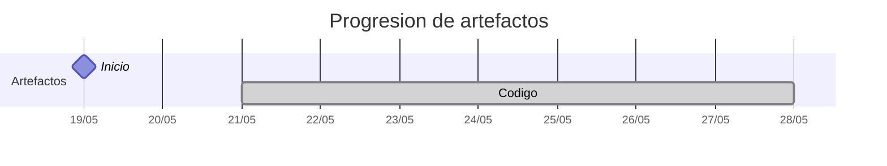

# Timeline - rubentresgallob

> Repo: [rubentresgallob/25-26-idsw2-sdVC](https://github.com/rubentresgallob/25-26-idsw2-sdVC)
> Commits: 8 | Días activos: 3 | Sesiones log: 0

## Patrón observado

| Métrica | Valor |
|---|---|
| Commits propios | 8 (1 feat / 0 fix / 7 other) |
| Días activos | 3 |
| Sesiones documentadas | 0 |

---

## Día 3 · 2026-05-21

### Commits (3: 1 feat / 0 fix)

| Hora | Mensaje |
|---|---|
| 21:04 | [Stack inicial y gestión de commits](https://github.com/rubentresgallob/25-26-idsw2-sdVC/commit/6822ab2a8852df78cbbf66c807ecf330e5793a90) |
| 21:03 | [feat: setup stack NestJS + Angular + Prisma](https://github.com/rubentresgallob/25-26-idsw2-sdVC/commit/e1aa18a69557357b9b2e6edaf9b20982a93afd68) |
| 20:46 | [Inicio proyecto](https://github.com/rubentresgallob/25-26-idsw2-sdVC/commit/b76cc77f405e3e82fe6302b3774e2bd8498e31ea) |

**Artefactos nuevos:** 🔌 

> ⚠️ Commits sin entrada en log

---

## Día 6 · 2026-05-24

### Commits (3: 0 feat / 0 fix)

| Hora | Mensaje |
|---|---|
| 18:13 | [Ajuste del peso de las preguntasExamen](https://github.com/rubentresgallob/25-26-idsw2-sdVC/commit/f6db991af31795913b90c28f6cf2f43134f8a108) |
| 18:09 | [Modelo examen primeras iteraciones](https://github.com/rubentresgallob/25-26-idsw2-sdVC/commit/902db9ba011d791ac05d636ec330d5969abe0922) |
| 17:55 | [Auth y primeros CRUD](https://github.com/rubentresgallob/25-26-idsw2-sdVC/commit/5efda56f7c2d85d36ed90717a4988d5dbd1c2b15) |

> ⚠️ Commits sin entrada en log

---

## Día 7 · 2026-05-25

### Commits (2: 0 feat / 0 fix)

| Hora | Mensaje |
|---|---|
| 21:40 | [Modulo grado](https://github.com/rubentresgallob/25-26-idsw2-sdVC/commit/0caf77f94bc8124be6ee6ad4dfe95f36b481318d) |
| 21:35 | [Empezamos frontend Auth + Core](https://github.com/rubentresgallob/25-26-idsw2-sdVC/commit/aef95eeaf8d9ce1f9d855cfe80bfb03b9c5423d2) |

> ⚠️ Commits sin entrada en log

---

